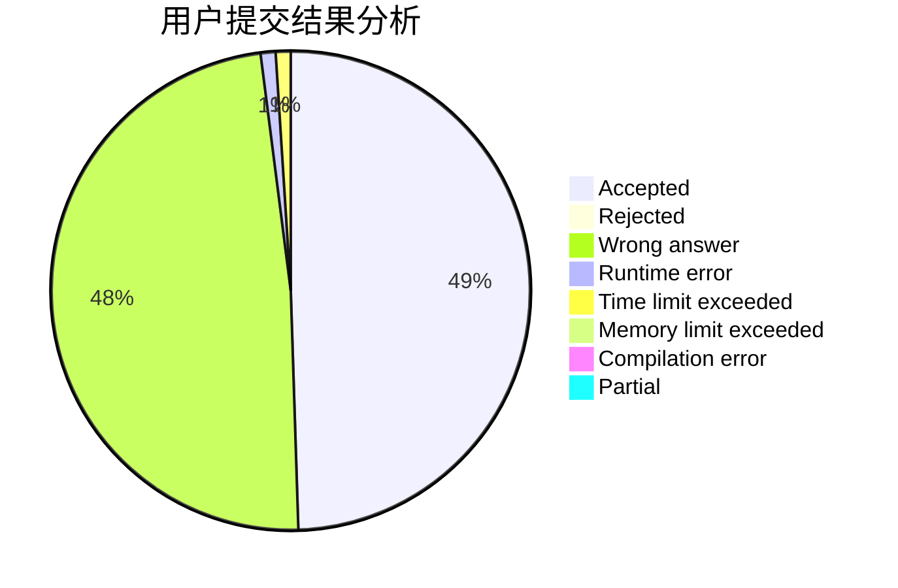
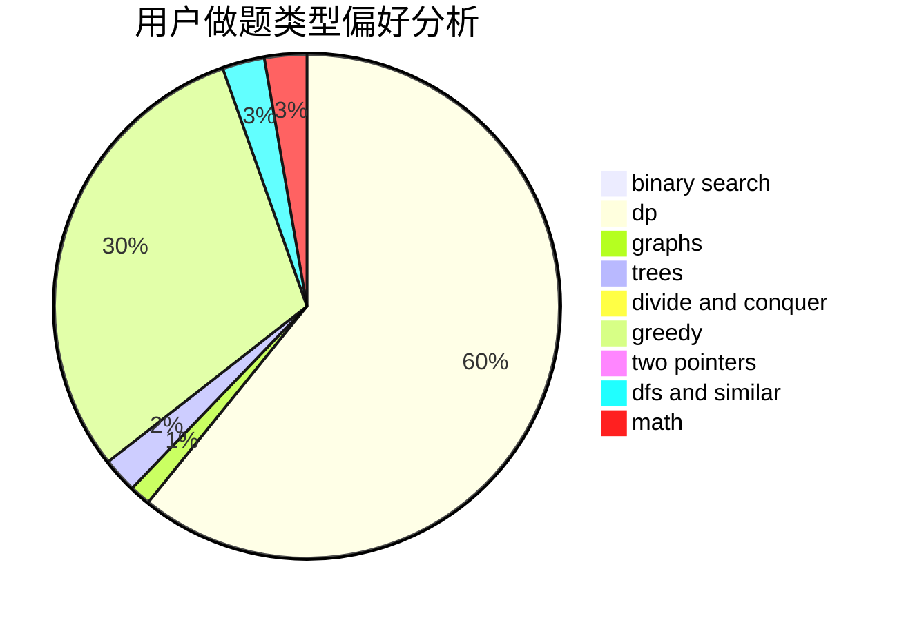

# wwwo

<!-- tabs:start -->

#### **用户提交结果分析**

#### **用户做题类型偏好分析**

<!-- tabs:end -->
# 推荐题目
[1178C](https://codeforces.com/contest/1178/problem/C)
[1054C](https://codeforces.com/contest/1054/problem/C)
[46A](https://codeforces.com/contest/46/problem/A)
[1240A](https://codeforces.com/contest/1240/problem/A)
[484A](https://codeforces.com/contest/484/problem/A)
[63C](https://codeforces.com/contest/63/problem/C)
[12162](https://codeforces.com/contest/1216/problem/2)
[10B](https://codeforces.com/contest/10/problem/B)
[52C](https://codeforces.com/contest/52/problem/C)
[682B](https://codeforces.com/contest/682/problem/B)
