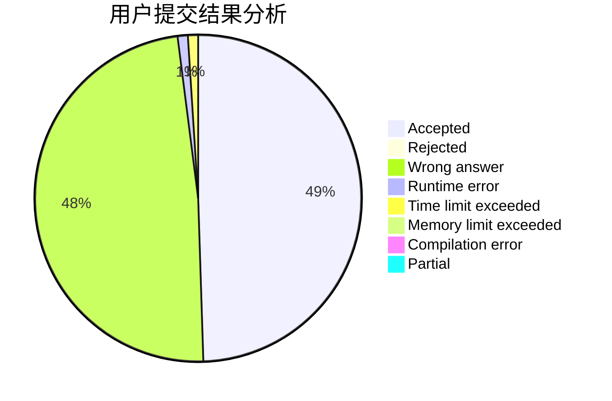
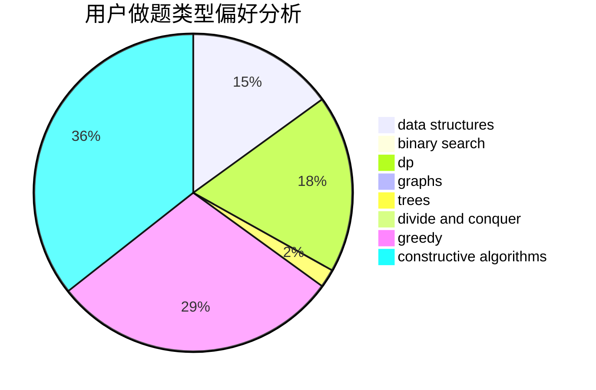
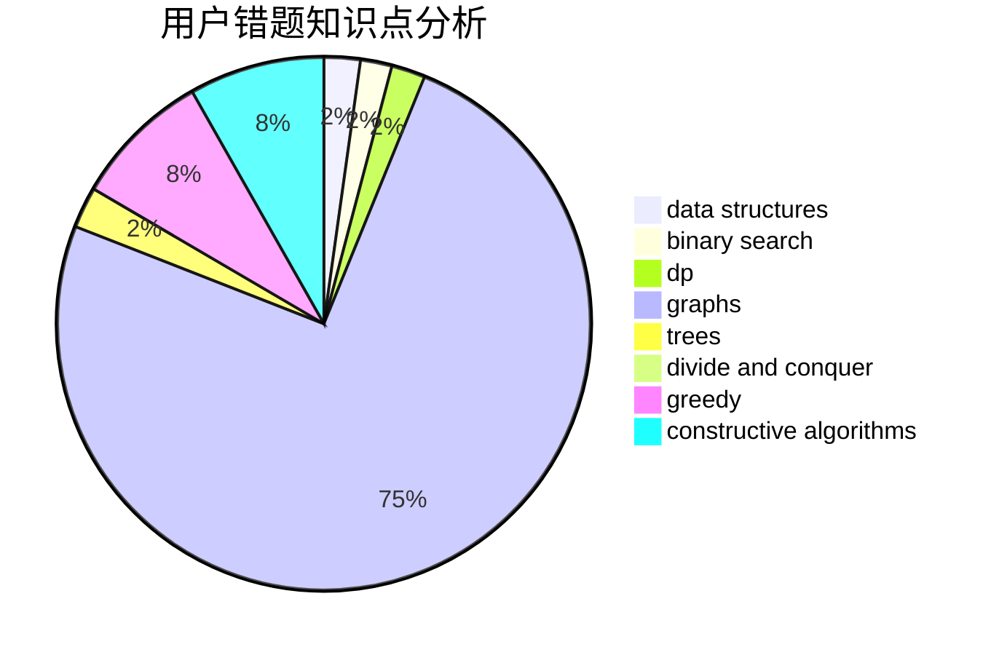

# wwwo

<!-- tabs:start -->

#### **用户提交结果分析**

#### **用户做题类型偏好分析**

#### **用户错题知识点分析**

<!-- tabs:end -->
# 推荐题目
[1178C](https://codeforces.com/contest/1178/problem/C)		combinatorics,
                        greedy,
                        math		  
[1054C](https://codeforces.com/contest/1054/problem/C)		constructive algorithms,
                        implementation		  
[46A](https://codeforces.com/contest/46/problem/A)		brute force,
                        implementation		  
[1240A](https://codeforces.com/contest/1240/problem/A)		dsu,graphs,sortings,trees		  
[484A](https://codeforces.com/contest/484/problem/A)		bitmasks,
                        constructive algorithms		  
[63C](https://codeforces.com/contest/63/problem/C)		brute force,
                        implementation		  
[12162](https://codeforces.com/contest/1216/problem/2)		dsu,graphs,sortings,trees		  
[10B](https://codeforces.com/contest/10/problem/B)		dp,
                        implementation		  
[52C](https://codeforces.com/contest/52/problem/C)		data structures		  
[682B](https://codeforces.com/contest/682/problem/B)		sortings		  
