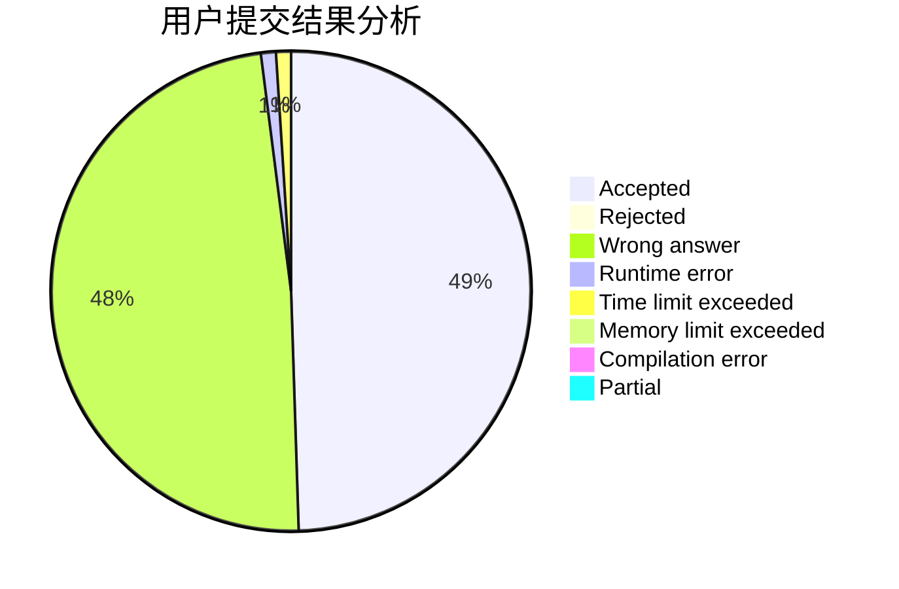
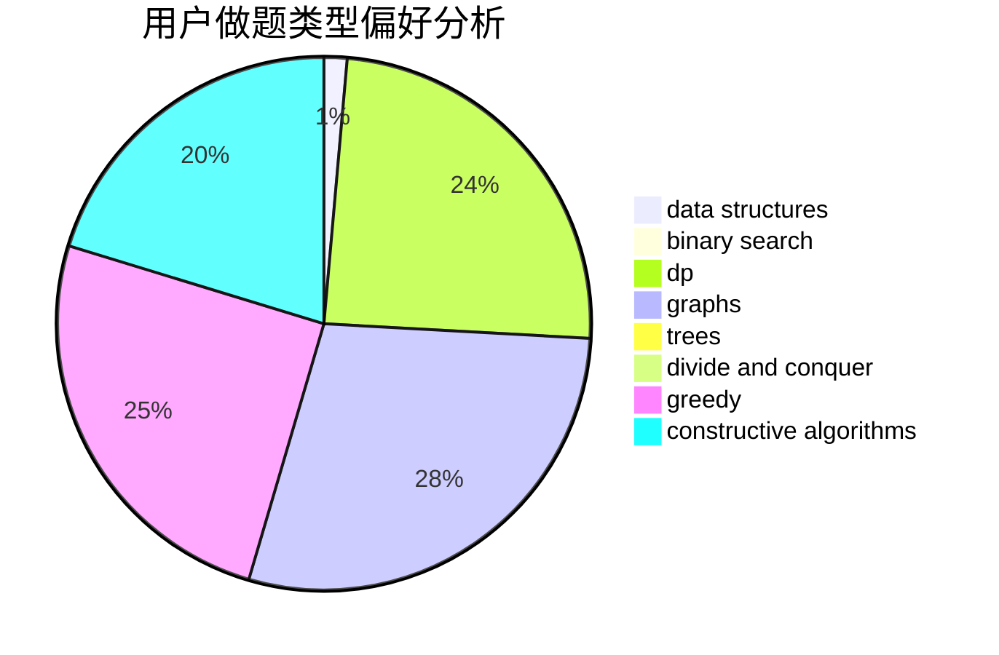
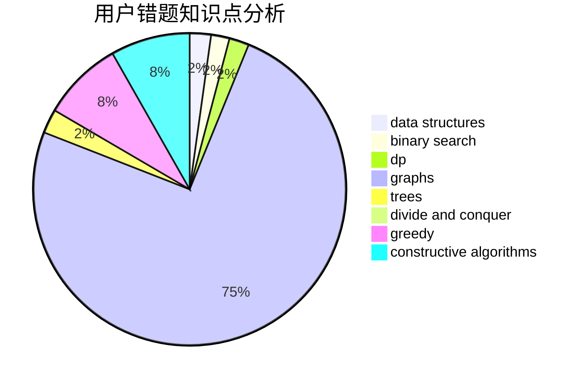

# wwwo

<!-- tabs:start -->

#### **用户提交结果分析**

#### **用户做题类型偏好分析**

#### **用户错题知识点分析**

<!-- tabs:end -->
# 推荐题目
[1175C](https://codeforces.com/contest/1175/problem/C)		binary search,
                        brute force,
                        greedy		  
[1053E](https://codeforces.com/contest/1053/problem/E)		constructive algorithms,
                        trees		  
[449D](https://codeforces.com/contest/449/problem/D)		bitmasks,
                        combinatorics,
                        dp		  
[1234D](https://codeforces.com/contest/1234/problem/D)		data structures		  
[464B](https://codeforces.com/contest/464/problem/B)		brute force,
                        geometry		  
[61A](https://codeforces.com/contest/61/problem/A)		implementation		  
[120H](https://codeforces.com/contest/120/problem/H)		graph matchings		  
[1099F](https://codeforces.com/contest/1099/problem/F)		binary search,
                        data structures,
                        dfs and similar,
                        dp,
                        games,
                        trees		  
[509D](https://codeforces.com/contest/509/problem/D)		constructive algorithms,
                        math		  
[662B](https://codeforces.com/contest/662/problem/B)		dfs and similar,
                        graphs		  
