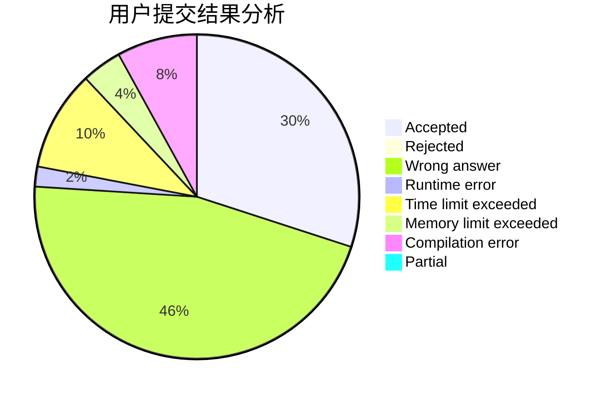
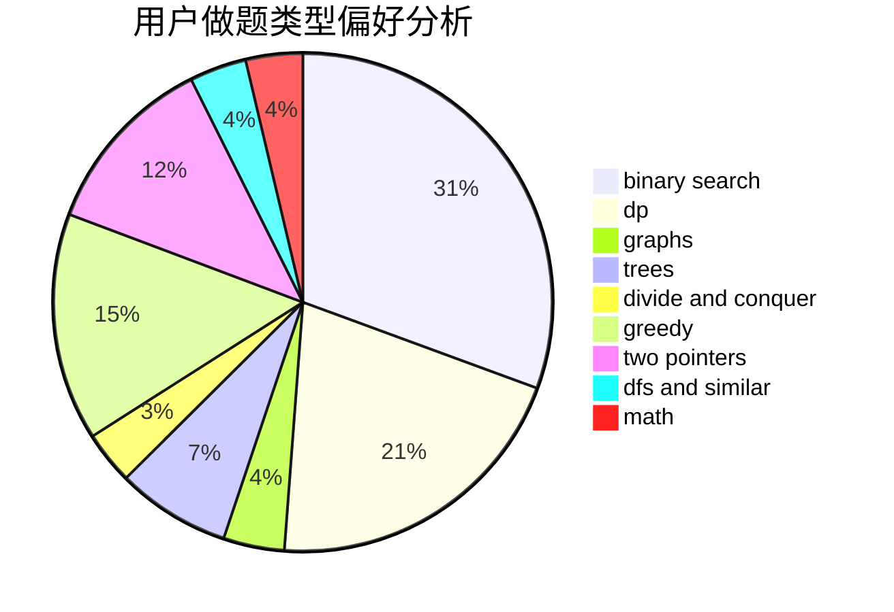

# wxk123

<!-- tabs:start -->

#### **用户提交结果分析**

#### **用户做题类型偏好分析**

<!-- tabs:end -->
# 推荐题目
[914A](https://codeforces.com/contest/914/problem/A)
[424A](https://codeforces.com/contest/424/problem/A)
[999D](https://codeforces.com/contest/999/problem/D)
[300C](https://codeforces.com/contest/300/problem/C)
[290B](https://codeforces.com/contest/290/problem/B)
[12162](https://codeforces.com/contest/1216/problem/2)
[457C](https://codeforces.com/contest/457/problem/C)
[352A](https://codeforces.com/contest/352/problem/A)
[1087A](https://codeforces.com/contest/1087/problem/A)
[1253E](https://codeforces.com/contest/1253/problem/E)
