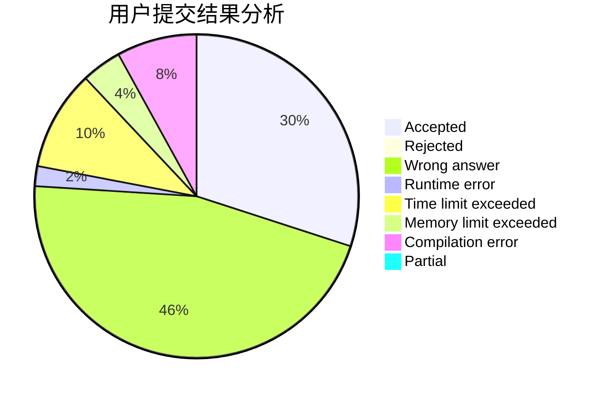
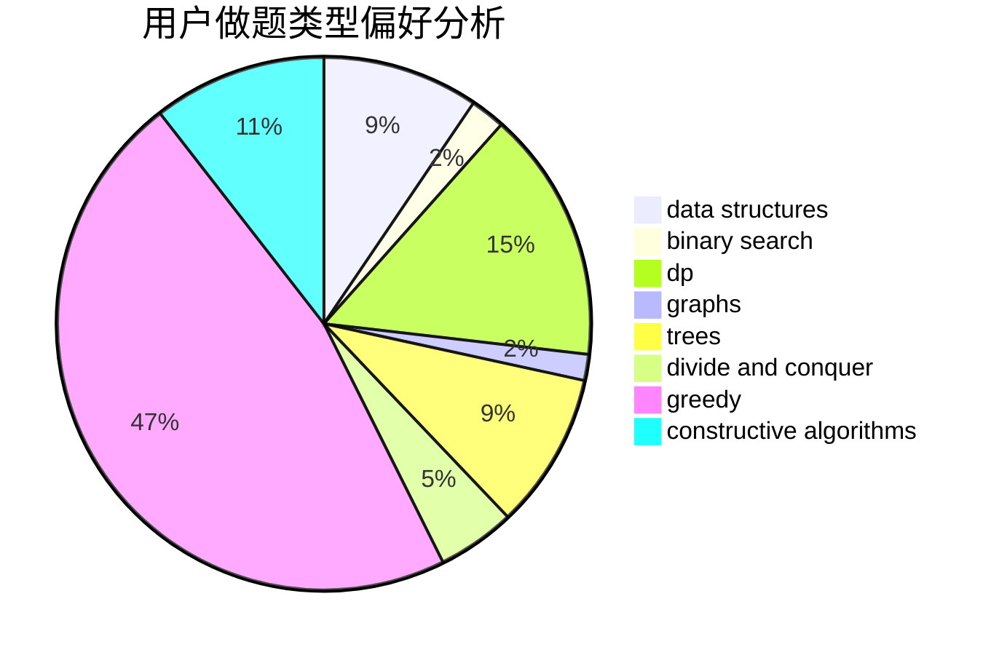
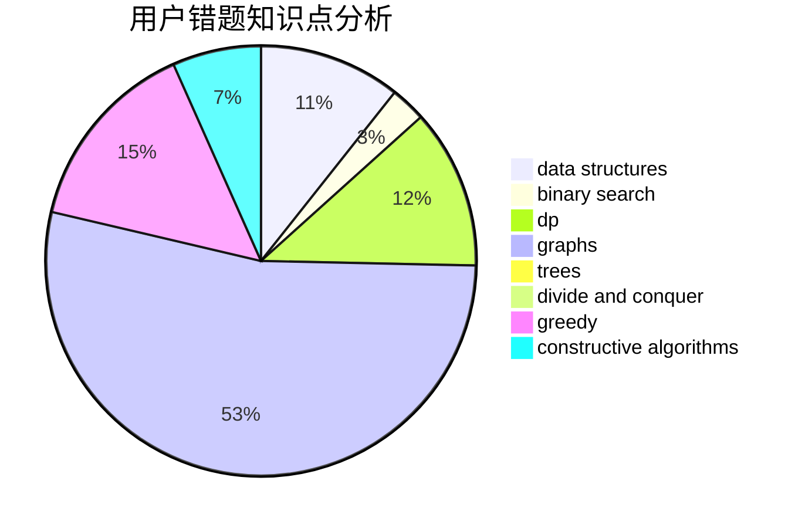

# wxk123

<!-- tabs:start -->

#### **用户提交结果分析**

#### **用户做题类型偏好分析**

#### **用户错题知识点分析**

<!-- tabs:end -->
# 推荐题目
[897B](https://codeforces.com/contest/897/problem/B)		brute force		  
[394C](https://codeforces.com/contest/394/problem/C)		constructive algorithms,
                        greedy		  
[983E](https://codeforces.com/contest/983/problem/E)		binary search,
                        data structures,
                        trees		  
[286B](https://codeforces.com/contest/286/problem/B)		implementation		  
[275B](https://codeforces.com/contest/275/problem/B)		constructive algorithms,
                        implementation		  
[120H](https://codeforces.com/contest/120/problem/H)		graph matchings		  
[436C](https://codeforces.com/contest/436/problem/C)		dsu,
                        graphs,
                        greedy,
                        trees		  
[321B](https://codeforces.com/contest/321/problem/B)		dp,
                        flows,
                        greedy		  
[1086C](https://codeforces.com/contest/1086/problem/C)		dsu,graphs,sortings,trees		  
[1249F](https://codeforces.com/contest/1249/problem/F)		dp,
                        trees		  
