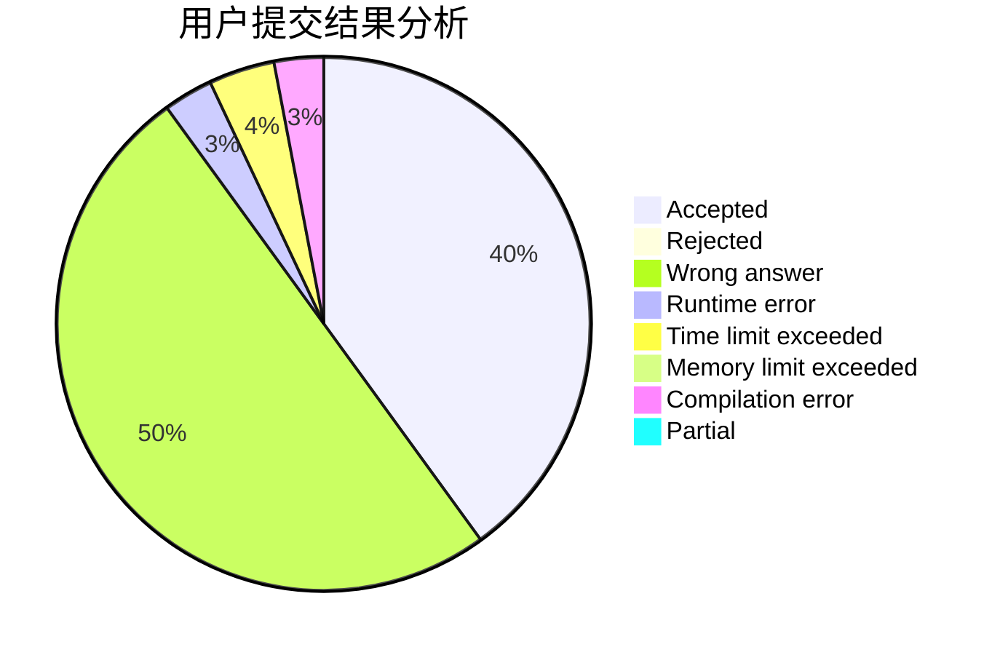
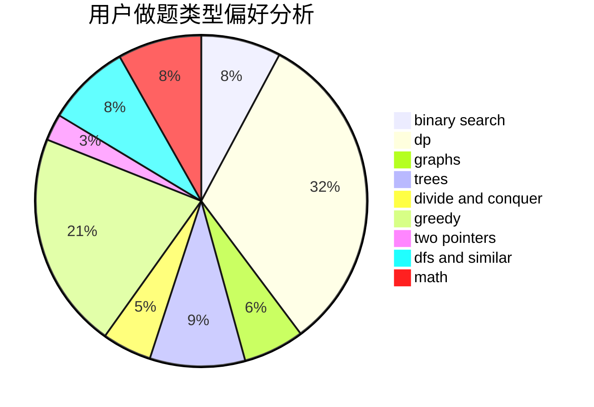

# wxx_louisa

<!-- tabs:start -->

#### **用户提交结果分析**

#### **用户做题类型偏好分析**

<!-- tabs:end -->
# 推荐题目
[1166F](https://codeforces.com/contest/1166/problem/F)
[198B](https://codeforces.com/contest/198/problem/B)
[383D](https://codeforces.com/contest/383/problem/D)
[507B](https://codeforces.com/contest/507/problem/B)
[996B](https://codeforces.com/contest/996/problem/B)
[1064F](https://codeforces.com/contest/1064/problem/F)
[305D](https://codeforces.com/contest/305/problem/D)
[100A](https://codeforces.com/contest/100/problem/A)
[645G](https://codeforces.com/contest/645/problem/G)
[1221G](https://codeforces.com/contest/1221/problem/G)
