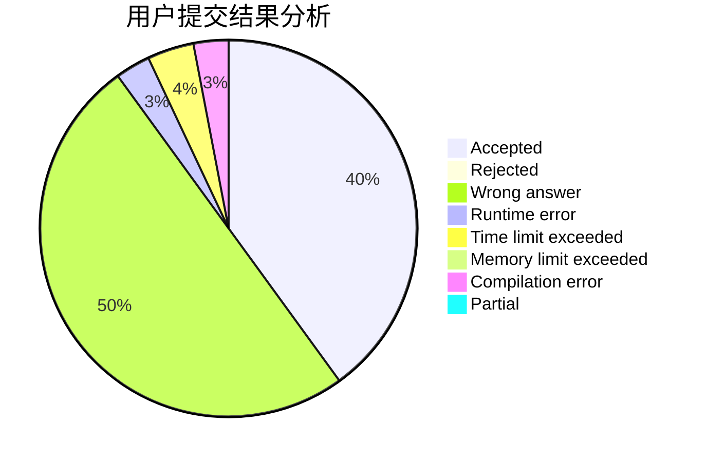
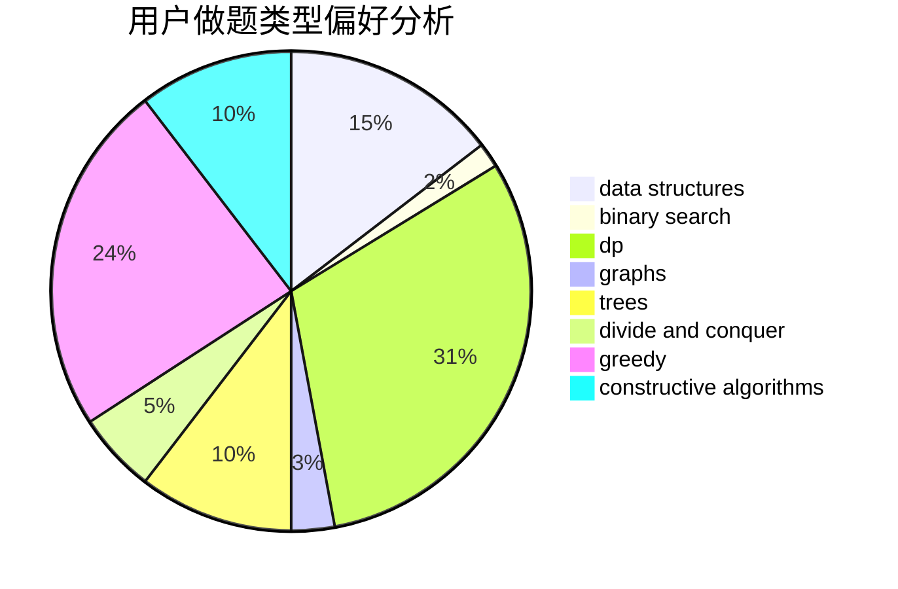
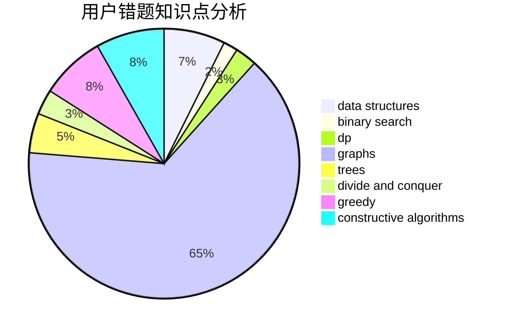

# wxx_louisa

<!-- tabs:start -->

#### **用户提交结果分析**

#### **用户做题类型偏好分析**

#### **用户错题知识点分析**

<!-- tabs:end -->
# 推荐题目
[1166F](https://codeforces.com/contest/1166/problem/F)		data structures,
                        dsu,
                        graphs,
                        hashing		  
[198B](https://codeforces.com/contest/198/problem/B)		shortest paths		  
[383D](https://codeforces.com/contest/383/problem/D)		dp		  
[507B](https://codeforces.com/contest/507/problem/B)		geometry,
                        math		  
[996B](https://codeforces.com/contest/996/problem/B)		binary search,
                        math		  
[1064F](https://codeforces.com/contest/1064/problem/F)		dsu,graphs,sortings,trees		  
[305D](https://codeforces.com/contest/305/problem/D)		combinatorics,
                        math		  
[100A](https://codeforces.com/contest/100/problem/A)		*special problem,
                        implementation		  
[645G](https://codeforces.com/contest/645/problem/G)		binary search,
                        geometry		  
[1221G](https://codeforces.com/contest/1221/problem/G)		bitmasks,
                        brute force,
                        combinatorics,
                        dp,
                        meet-in-the-middle		  
