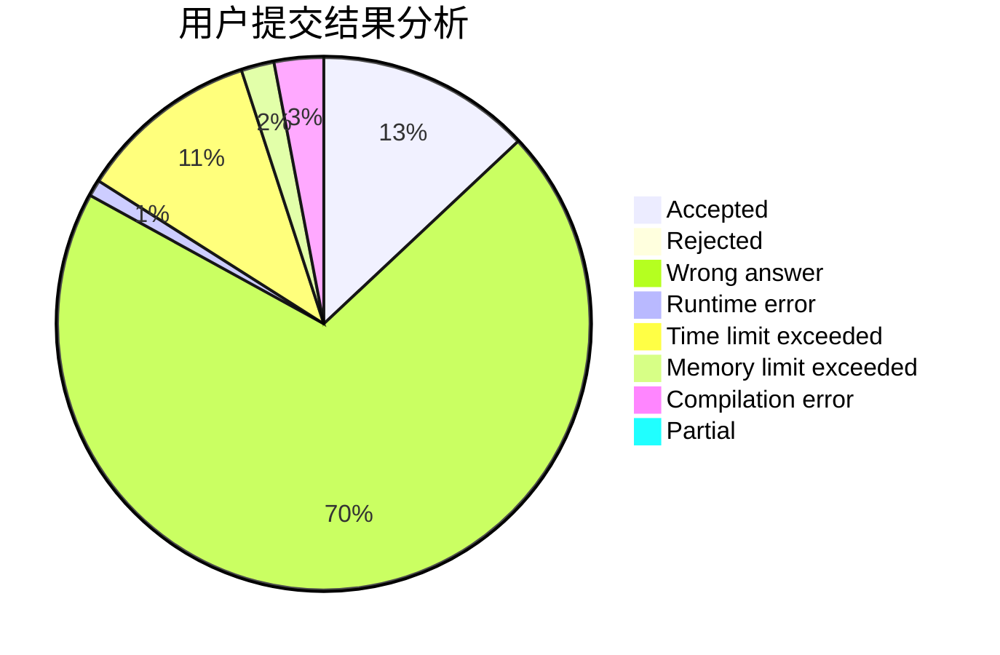
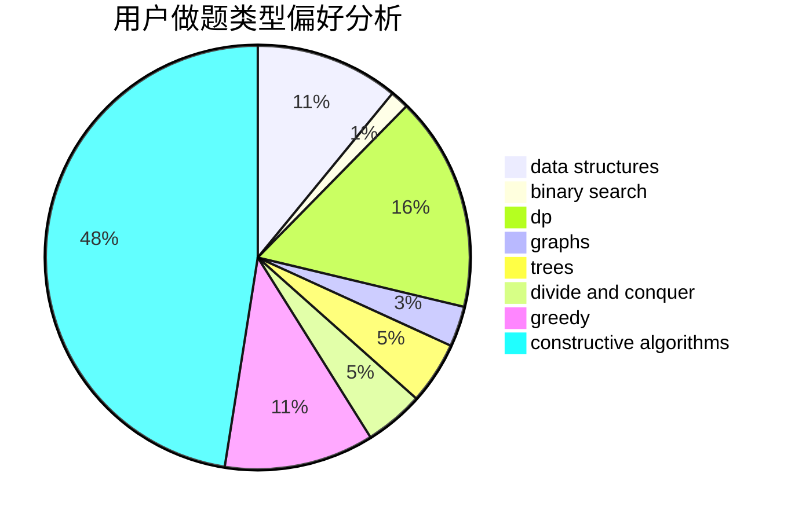

# wxywxywxy_

<!-- tabs:start -->

#### **用户提交结果分析**

#### **用户做题类型偏好分析**

#### **用户错题知识点分析**

<!-- tabs:end -->
# 推荐题目
[1320C](https://codeforces.com/contest/1320/problem/C)		brute force,
                        data structures,
                        sortings		  
[767B](https://codeforces.com/contest/767/problem/B)		brute force,
                        greedy		  
[453D](https://codeforces.com/contest/453/problem/D)		dp,
                        matrices		  
[582B](https://codeforces.com/contest/582/problem/B)		constructive algorithms,
                        dp,
                        matrices		  
[297D](https://codeforces.com/contest/297/problem/D)		constructive algorithms		  
[1267B](https://codeforces.com/contest/1267/problem/B)		nan		  
[1082C](https://codeforces.com/contest/1082/problem/C)		greedy,
                        sortings		  
[1110F](https://codeforces.com/contest/1110/problem/F)		data structures,
                        trees		  
[773E](https://codeforces.com/contest/773/problem/E)		data structures,
                        sortings		  
[407E](https://codeforces.com/contest/407/problem/E)		data structures		  
