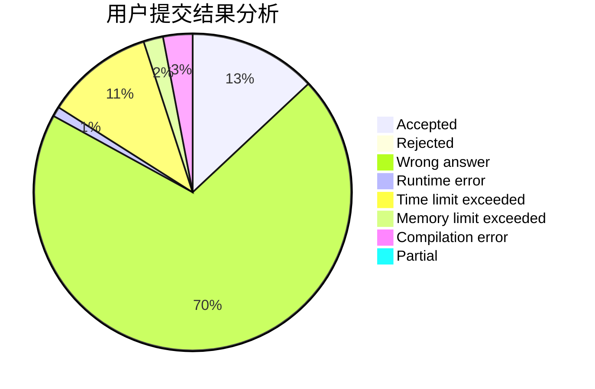
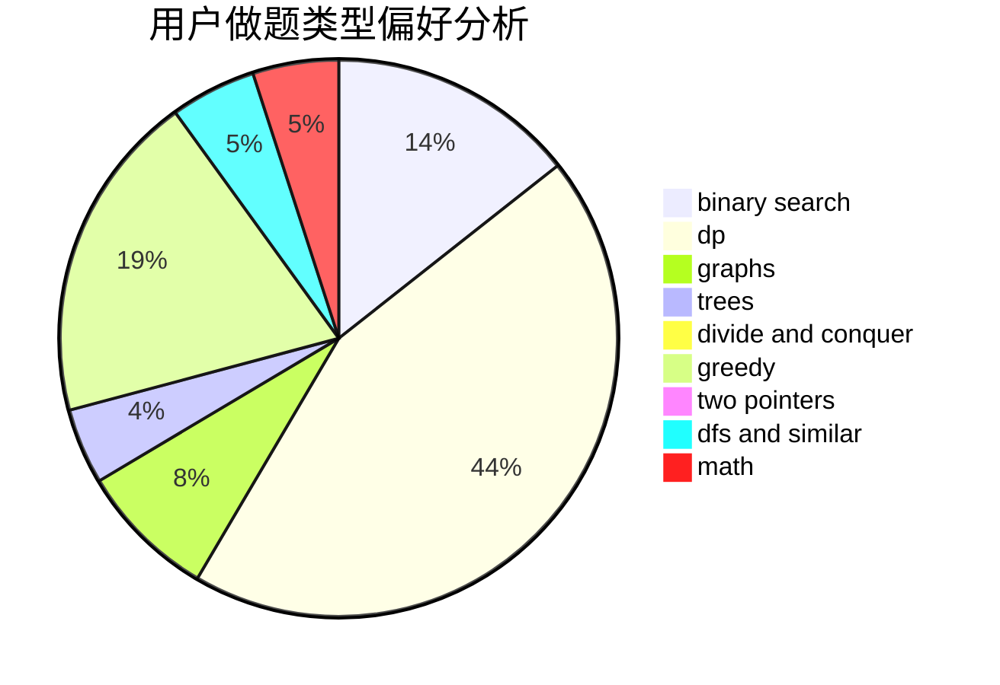

# wxywxywxy_

<!-- tabs:start -->

#### **用户提交结果分析**

#### **用户做题类型偏好分析**

<!-- tabs:end -->
# 推荐题目
[1327C](https://codeforces.com/contest/1327/problem/C)
[786D](https://codeforces.com/contest/786/problem/D)
[475D](https://codeforces.com/contest/475/problem/D)
[603B](https://codeforces.com/contest/603/problem/B)
[314C](https://codeforces.com/contest/314/problem/C)
[1272E](https://codeforces.com/contest/1272/problem/E)
[1082F](https://codeforces.com/contest/1082/problem/F)
[1111A](https://codeforces.com/contest/1111/problem/A)
[792E](https://codeforces.com/contest/792/problem/E)
[436C](https://codeforces.com/contest/436/problem/C)
