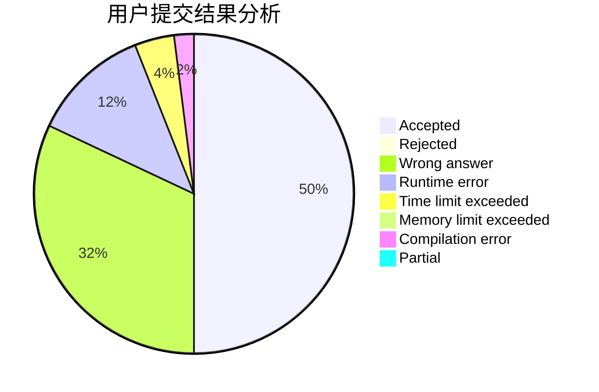
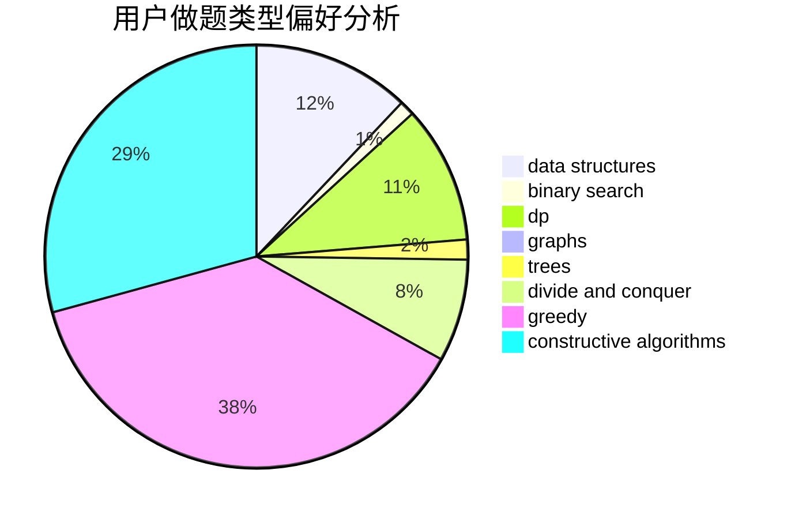
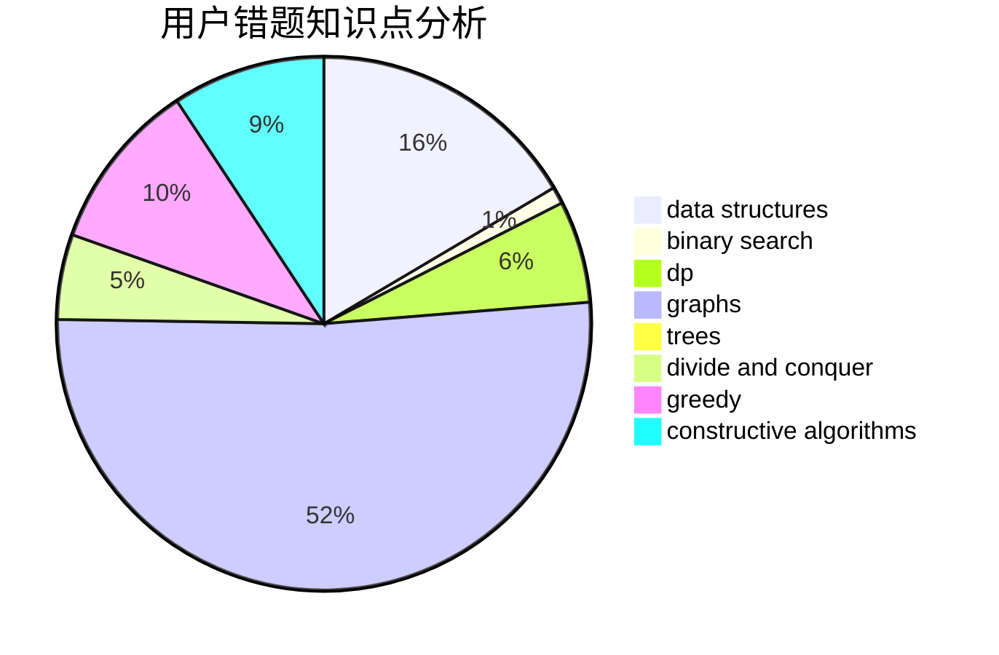

# wxyzf

<!-- tabs:start -->

#### **用户提交结果分析**

#### **用户做题类型偏好分析**

#### **用户错题知识点分析**

<!-- tabs:end -->
# 推荐题目
[14861](https://codeforces.com/contest/1486/problem/1)		dsu,graphs,sortings,trees		  
[799F](https://codeforces.com/contest/799/problem/F)		data structures		  
[1296B](https://codeforces.com/contest/1296/problem/B)		math		  
[329B](https://codeforces.com/contest/329/problem/B)		dfs and similar,
                        shortest paths		  
[13701](https://codeforces.com/contest/1370/problem/1)		dsu,graphs,sortings,trees		  
[1023D](https://codeforces.com/contest/1023/problem/D)		constructive algorithms,
                        data structures		  
[1117D](https://codeforces.com/contest/1117/problem/D)		dp,
                        math,
                        matrices		  
[11951](https://codeforces.com/contest/1195/problem/1)		dsu,graphs,sortings,trees		  
[754C](https://codeforces.com/contest/754/problem/C)		brute force,
                        constructive algorithms,
                        dp,
                        implementation,
                        strings		  
[1418D](https://codeforces.com/contest/1418/problem/D)		data structures,
                        implementation		  
