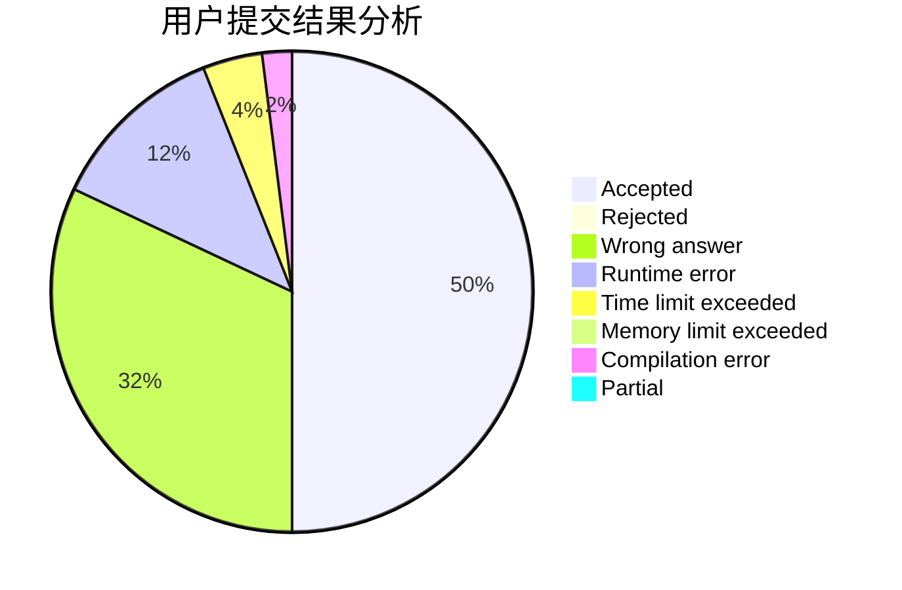
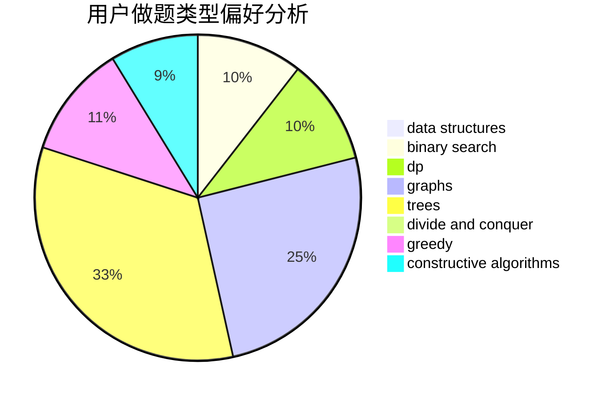
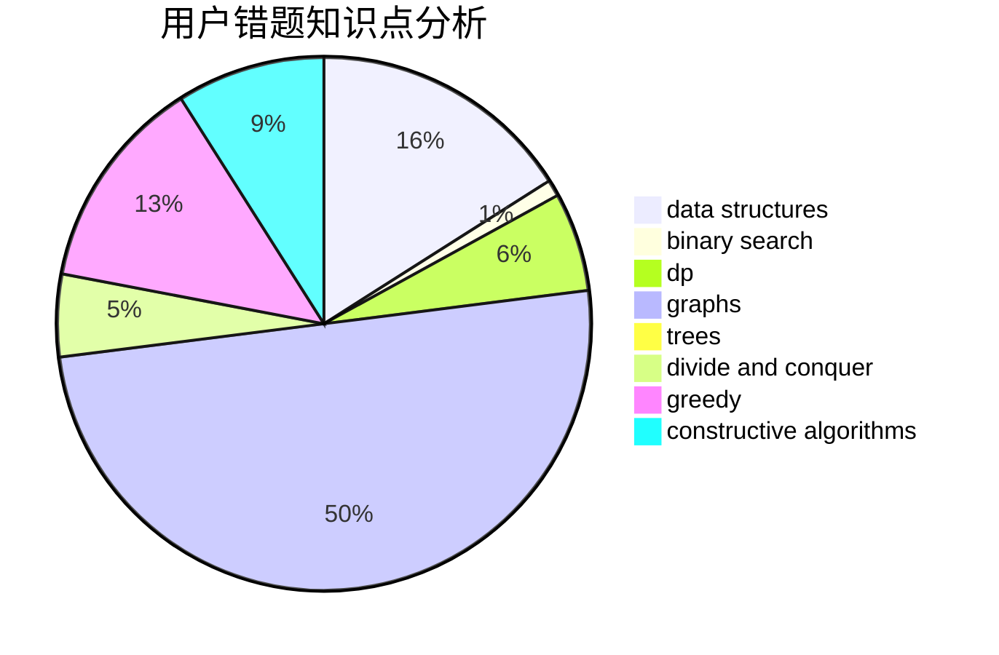

# wxyzf

<!-- tabs:start -->

#### **用户提交结果分析**

#### **用户做题类型偏好分析**

#### **用户错题知识点分析**

<!-- tabs:end -->
# 推荐题目
[1477B](https://codeforces.com/contest/1477/problem/B)		data structures,
                        greedy		  
[780G](https://codeforces.com/contest/780/problem/G)		data structures,
                        dp		  
[128C](https://codeforces.com/contest/128/problem/C)		combinatorics,
                        dp		  
[306D](https://codeforces.com/contest/306/problem/D)		constructive algorithms,
                        geometry		  
[1362F](https://codeforces.com/contest/1362/problem/F)		dsu,graphs,sortings,trees		  
[1023A](https://codeforces.com/contest/1023/problem/A)		brute force,
                        implementation,
                        strings		  
[1116A2](https://codeforces.com/contest/1116A/problem/2)		nan		  
[1189D2](https://codeforces.com/contest/1189D/problem/2)		dsu,graphs,sortings,trees		  
[734A](https://codeforces.com/contest/734/problem/A)		implementation,
                        strings		  
[1407E](https://codeforces.com/contest/1407/problem/E)		constructive algorithms,
                        dfs and similar,
                        dp,
                        graphs,
                        greedy,
                        shortest paths		  
