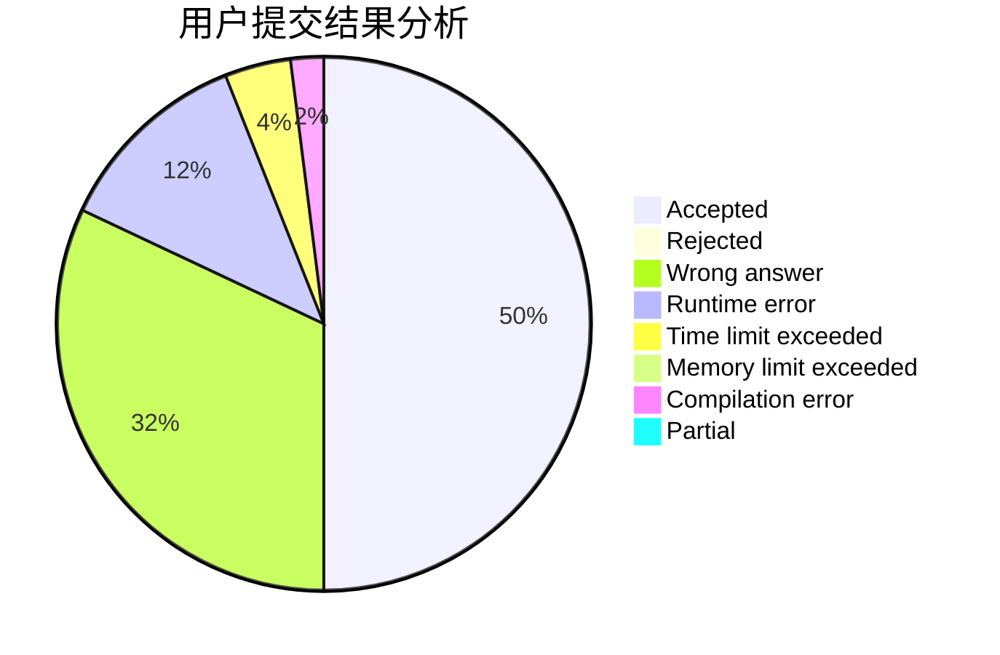
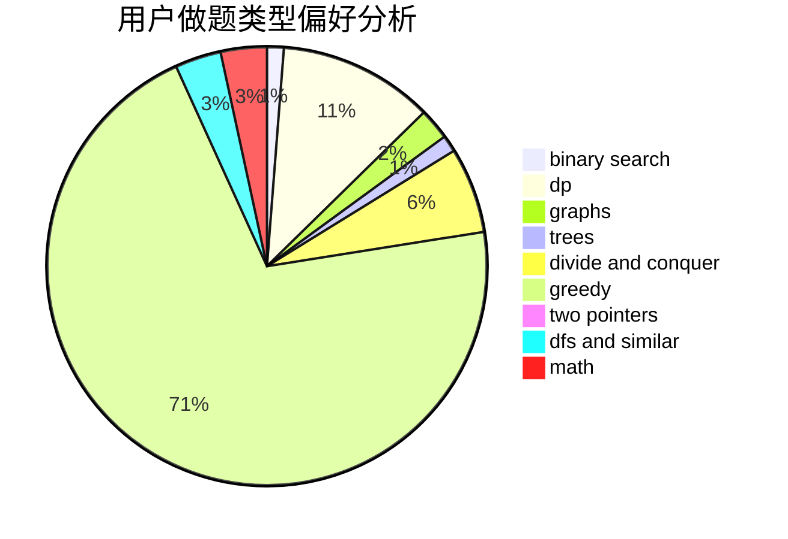

# wxyzf

<!-- tabs:start -->

#### **用户提交结果分析**

#### **用户做题类型偏好分析**

<!-- tabs:end -->
# 推荐题目
[14861](https://codeforces.com/contest/1486/problem/1)
[799F](https://codeforces.com/contest/799/problem/F)
[1296B](https://codeforces.com/contest/1296/problem/B)
[329B](https://codeforces.com/contest/329/problem/B)
[13701](https://codeforces.com/contest/1370/problem/1)
[1023D](https://codeforces.com/contest/1023/problem/D)
[1117D](https://codeforces.com/contest/1117/problem/D)
[11951](https://codeforces.com/contest/1195/problem/1)
[754C](https://codeforces.com/contest/754/problem/C)
[1418D](https://codeforces.com/contest/1418/problem/D)
