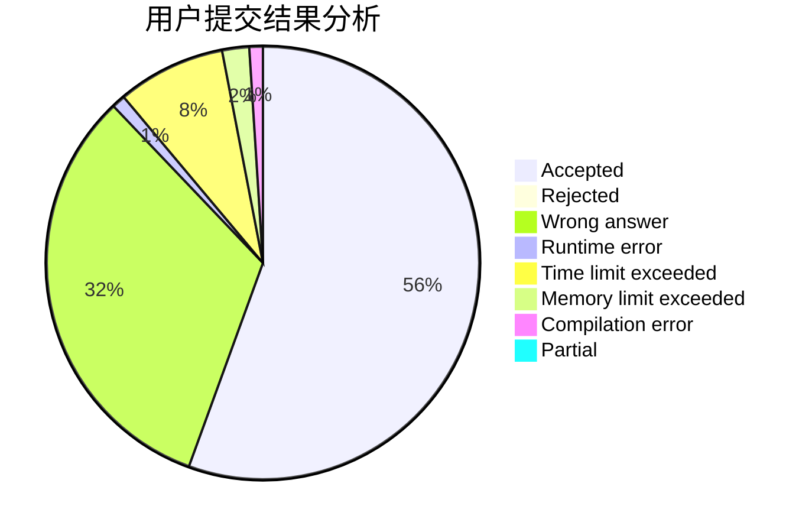
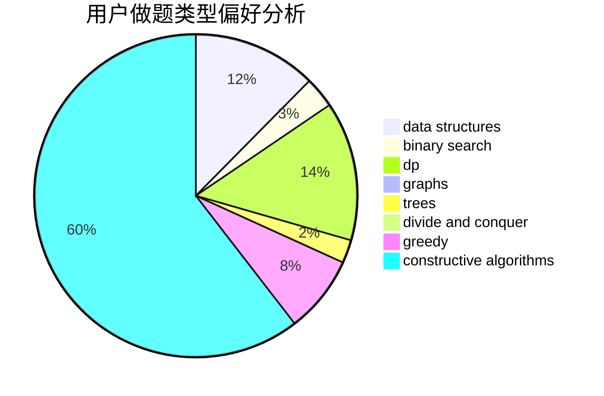
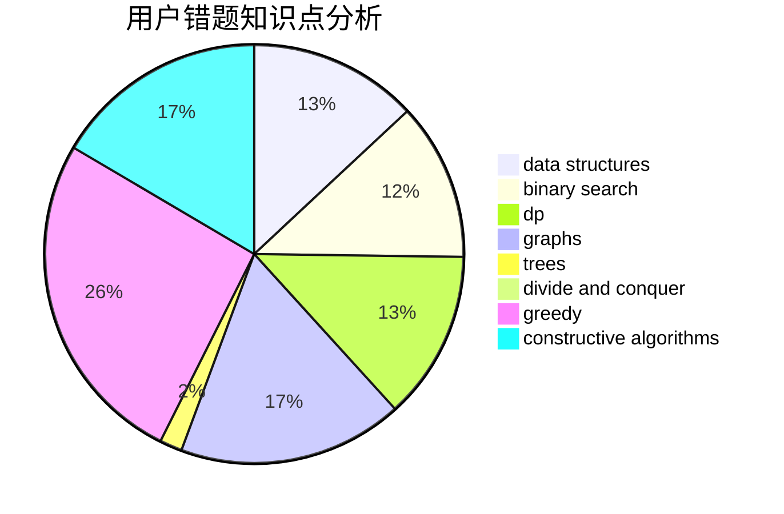

# wygzgyw

<!-- tabs:start -->

#### **用户提交结果分析**

#### **用户做题类型偏好分析**

#### **用户错题知识点分析**

<!-- tabs:end -->
# 推荐题目
[1357A7](https://codeforces.com/contest/1357A/problem/7)		nan		  
[1217A](https://codeforces.com/contest/1217/problem/A)		binary search,
                        math		  
[832C](https://codeforces.com/contest/832/problem/C)		binary search,
                        implementation,
                        math		  
[1156B](https://codeforces.com/contest/1156/problem/B)		dfs and similar,
                        greedy,
                        implementation,
                        sortings,
                        strings		  
[1179D](https://codeforces.com/contest/1179/problem/D)		data structures,
                        dp,
                        trees		  
[197D](https://codeforces.com/contest/197/problem/D)		dsu,graphs,sortings,trees		  
[952E](https://codeforces.com/contest/952/problem/E)		nan		  
[505E](https://codeforces.com/contest/505/problem/E)		binary search,
                        greedy		  
[1247C](https://codeforces.com/contest/1247/problem/C)		dsu,graphs,sortings,trees		  
[540A](https://codeforces.com/contest/540/problem/A)		implementation		  
