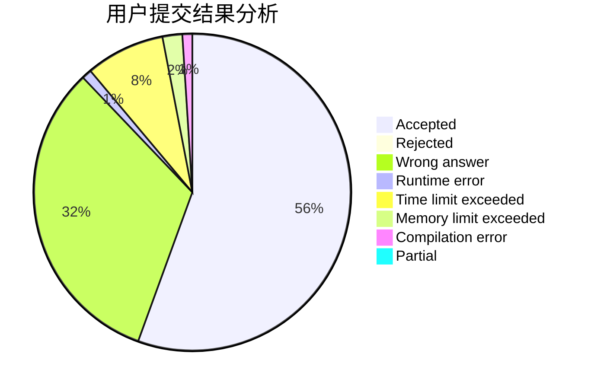
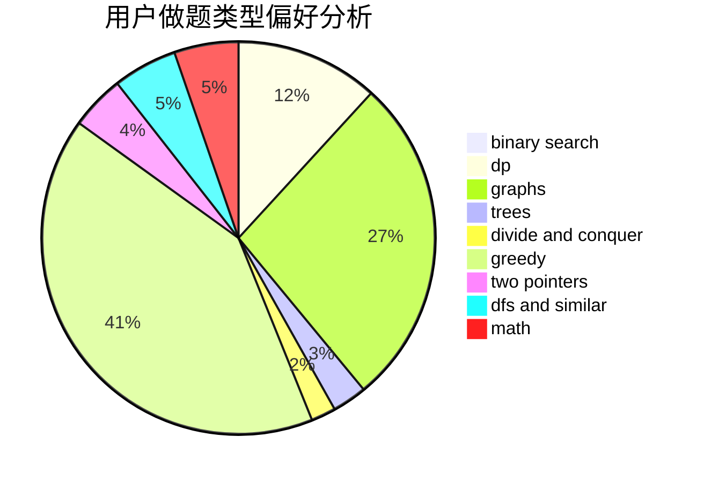

# wygzgyw

<!-- tabs:start -->

#### **用户提交结果分析**

#### **用户做题类型偏好分析**

<!-- tabs:end -->
# 推荐题目
[1364C](https://codeforces.com/contest/1364/problem/C)
[1223E](https://codeforces.com/contest/1223/problem/E)
[850E](https://codeforces.com/contest/850/problem/E)
[1157G](https://codeforces.com/contest/1157/problem/G)
[1182C](https://codeforces.com/contest/1182/problem/C)
[219C](https://codeforces.com/contest/219/problem/C)
[975D](https://codeforces.com/contest/975/problem/D)
[526B](https://codeforces.com/contest/526/problem/B)
[1251B](https://codeforces.com/contest/1251/problem/B)
[566A](https://codeforces.com/contest/566/problem/A)
