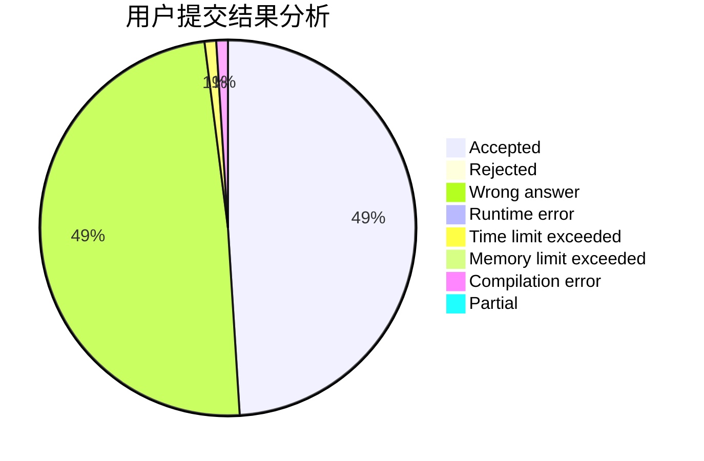
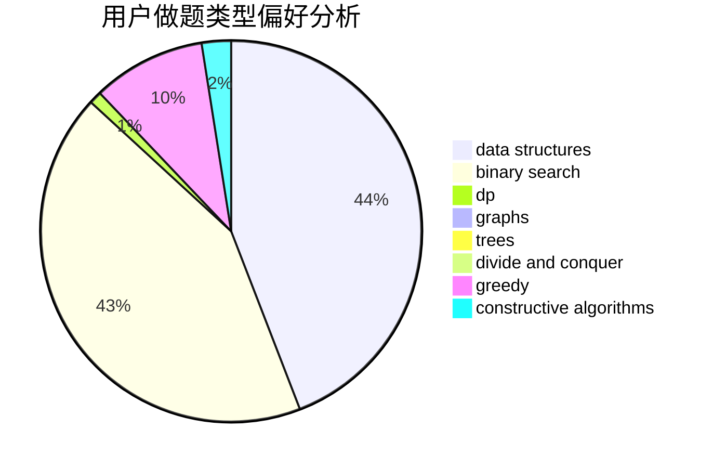
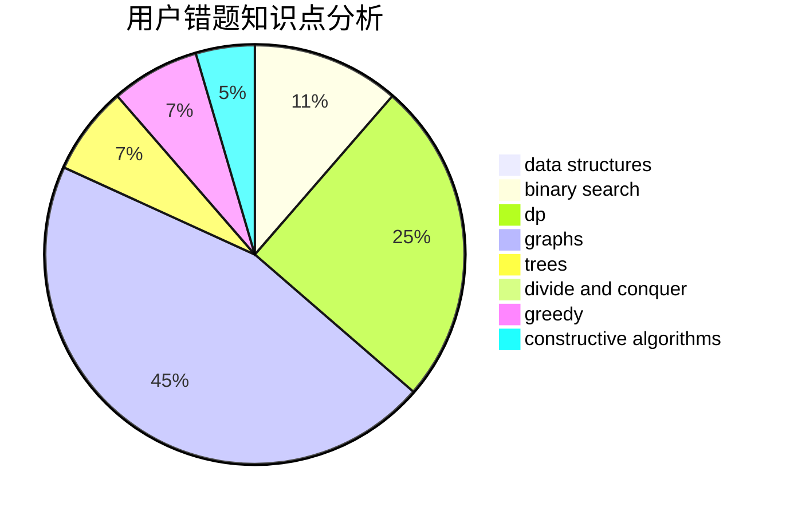

# wythend

<!-- tabs:start -->

#### **用户提交结果分析**

#### **用户做题类型偏好分析**

#### **用户错题知识点分析**

<!-- tabs:end -->
# 推荐题目
[464B](https://codeforces.com/contest/464/problem/B)		brute force,
                        geometry		  
[750D](https://codeforces.com/contest/750/problem/D)		brute force,
                        data structures,
                        dfs and similar,
                        dp,
                        implementation		  
[690D1](https://codeforces.com/contest/690D/problem/1)		nan		  
[983D](https://codeforces.com/contest/983/problem/D)		data structures		  
[1111E](https://codeforces.com/contest/1111/problem/E)		data structures,
                        dfs and similar,
                        dp,
                        graphs,
                        trees		  
[1290E](https://codeforces.com/contest/1290/problem/E)		data structures		  
[831A](https://codeforces.com/contest/831/problem/A)		implementation		  
[90E](https://codeforces.com/contest/90/problem/E)		dsu,graphs,sortings,trees		  
[1406E](https://codeforces.com/contest/1406/problem/E)		interactive,
                        math,
                        number theory		  
[7A](https://codeforces.com/contest/7/problem/A)		brute force,
                        constructive algorithms		  
