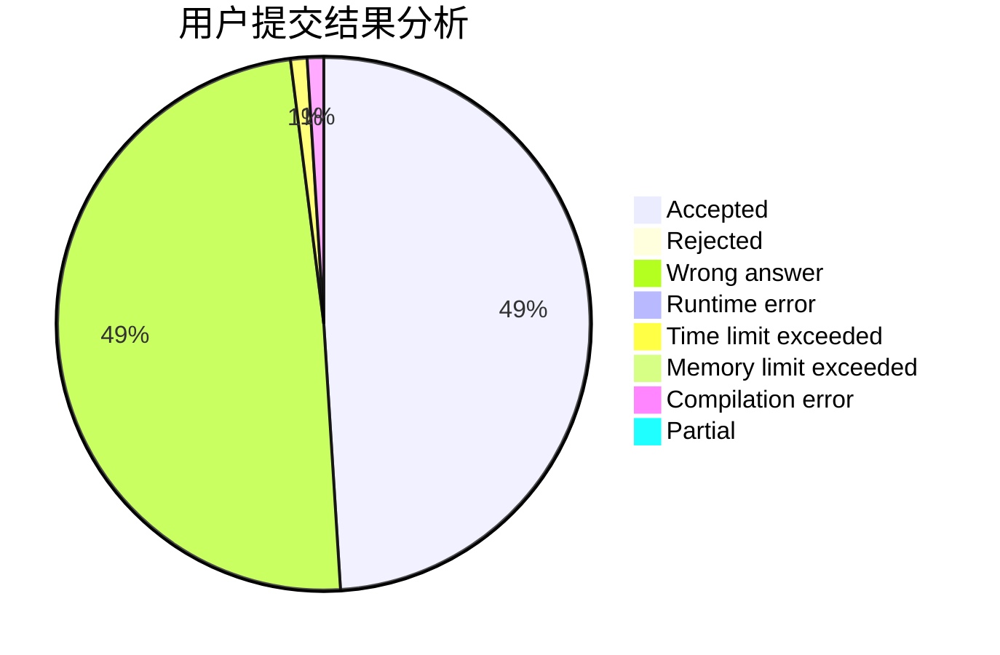
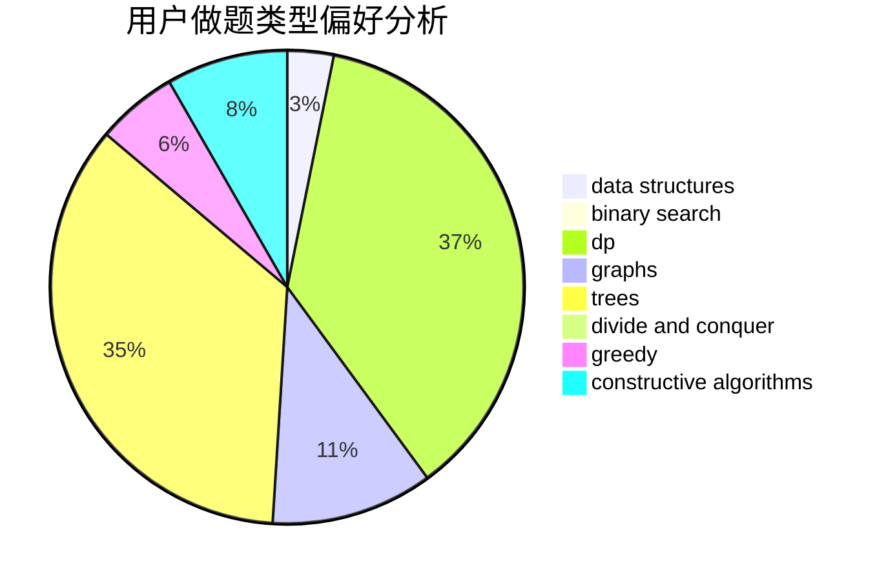
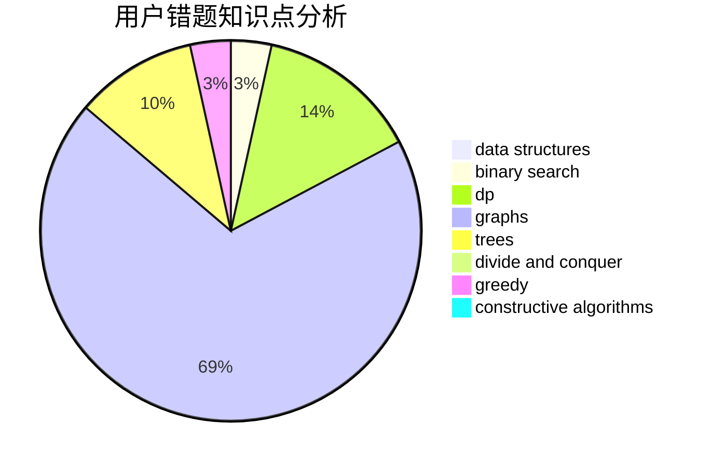

# wythend

<!-- tabs:start -->

#### **用户提交结果分析**

#### **用户做题类型偏好分析**

#### **用户错题知识点分析**

<!-- tabs:end -->
# 推荐题目
[484A](https://codeforces.com/contest/484/problem/A)		bitmasks,
                        constructive algorithms		  
[76D](https://codeforces.com/contest/76/problem/D)		dp,
                        greedy,
                        math		  
[710D](https://codeforces.com/contest/710/problem/D)		math,
                        number theory		  
[999C](https://codeforces.com/contest/999/problem/C)		implementation		  
[1113C](https://codeforces.com/contest/1113/problem/C)		dsu,graphs,sortings,trees		  
[1297B](https://codeforces.com/contest/1297/problem/B)		*special problem,
                        implementation,
                        sortings		  
[849A](https://codeforces.com/contest/849/problem/A)		implementation		  
[924E](https://codeforces.com/contest/924/problem/E)		nan		  
[1417E](https://codeforces.com/contest/1417/problem/E)		dsu,graphs,sortings,trees		  
[814B](https://codeforces.com/contest/814/problem/B)		constructive algorithms		  
