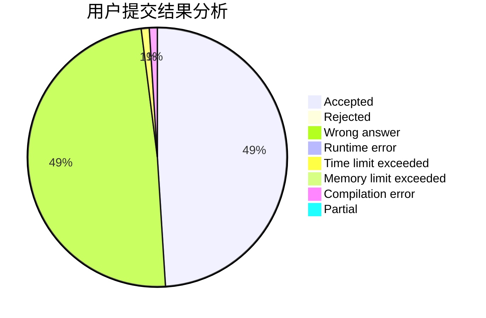
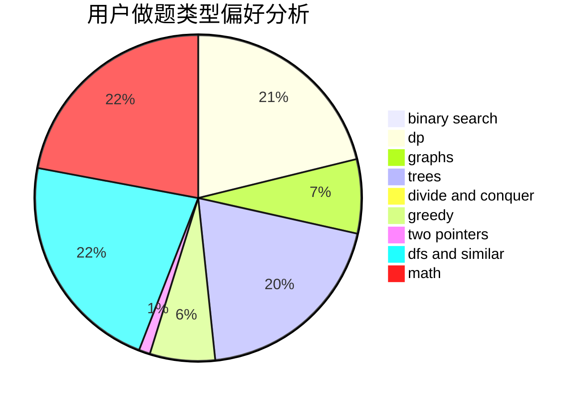

# wythend

<!-- tabs:start -->

#### **用户提交结果分析**

#### **用户做题类型偏好分析**

<!-- tabs:end -->
# 推荐题目
[484A](https://codeforces.com/contest/484/problem/A)
[76D](https://codeforces.com/contest/76/problem/D)
[710D](https://codeforces.com/contest/710/problem/D)
[999C](https://codeforces.com/contest/999/problem/C)
[1113C](https://codeforces.com/contest/1113/problem/C)
[1297B](https://codeforces.com/contest/1297/problem/B)
[849A](https://codeforces.com/contest/849/problem/A)
[924E](https://codeforces.com/contest/924/problem/E)
[1417E](https://codeforces.com/contest/1417/problem/E)
[814B](https://codeforces.com/contest/814/problem/B)
