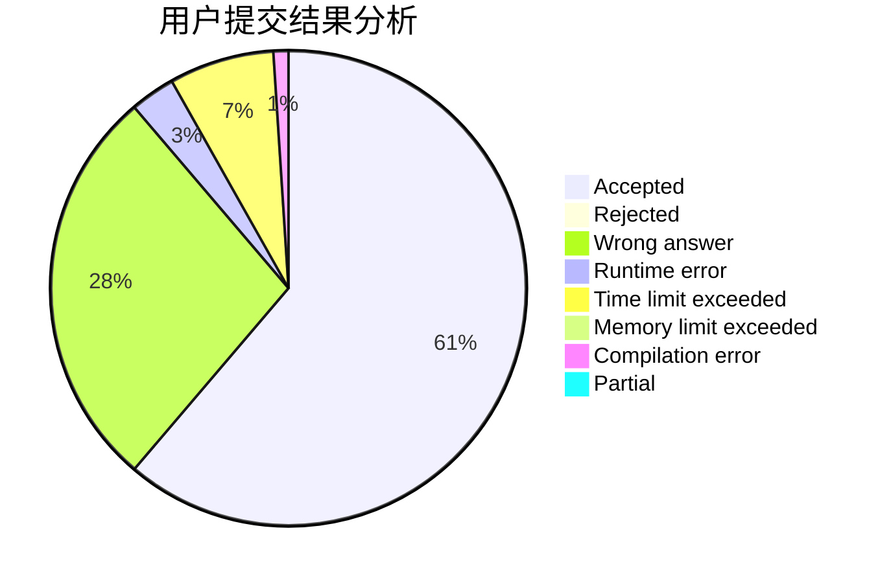
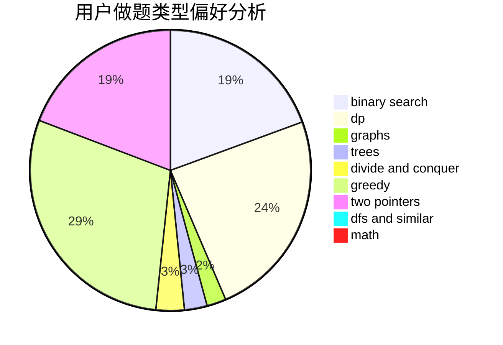

# wyzwyz

<!-- tabs:start -->

#### **用户提交结果分析**

#### **用户做题类型偏好分析**

<!-- tabs:end -->
# 推荐题目
[671A](https://codeforces.com/contest/671/problem/A)
[1083D](https://codeforces.com/contest/1083/problem/D)
[776D](https://codeforces.com/contest/776/problem/D)
[1166D](https://codeforces.com/contest/1166/problem/D)
[77B](https://codeforces.com/contest/77/problem/B)
[614D](https://codeforces.com/contest/614/problem/D)
[1151F](https://codeforces.com/contest/1151/problem/F)
[11411](https://codeforces.com/contest/1141/problem/1)
[1093G](https://codeforces.com/contest/1093/problem/G)
[1109E](https://codeforces.com/contest/1109/problem/E)
