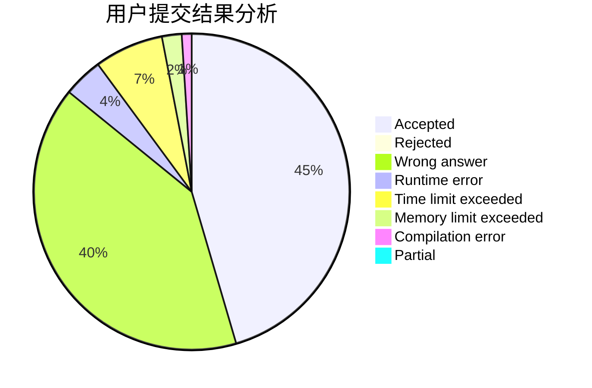
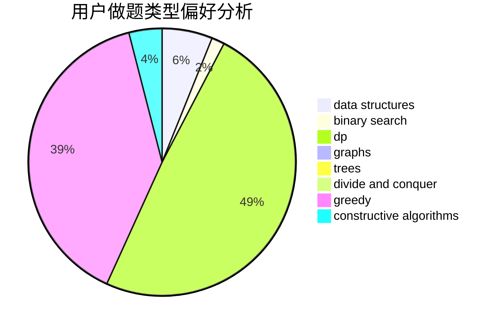

# wzc1995

<!-- tabs:start -->

#### **用户提交结果分析**

#### **用户做题类型偏好分析**

#### **用户错题知识点分析**

<!-- tabs:end -->
# 推荐题目
[963C](https://codeforces.com/contest/963/problem/C)		brute force,
                        math,
                        number theory		  
[323C](https://codeforces.com/contest/323/problem/C)		data structures		  
[431E](https://codeforces.com/contest/431/problem/E)		binary search,
                        data structures,
                        ternary search		  
[1162C](https://codeforces.com/contest/1162/problem/C)		dsu,graphs,sortings,trees		  
[363B](https://codeforces.com/contest/363/problem/B)		brute force,
                        dp		  
[1090B](https://codeforces.com/contest/1090/problem/B)		nan		  
[553A](https://codeforces.com/contest/553/problem/A)		combinatorics,
                        dp,
                        math		  
[1345F](https://codeforces.com/contest/1345/problem/F)		dsu,graphs,sortings,trees		  
[295A](https://codeforces.com/contest/295/problem/A)		data structures,
                        implementation		  
[820D](https://codeforces.com/contest/820/problem/D)		dsu,graphs,sortings,trees		  
