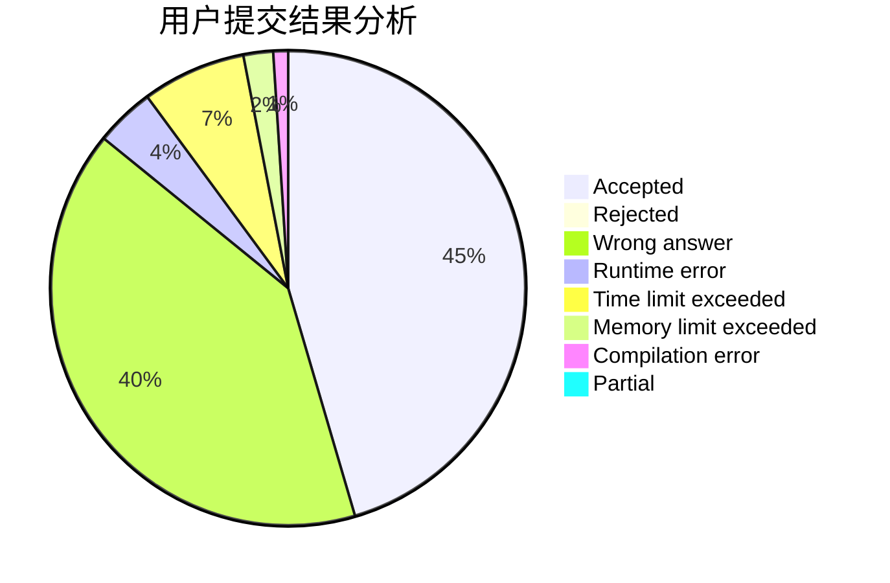
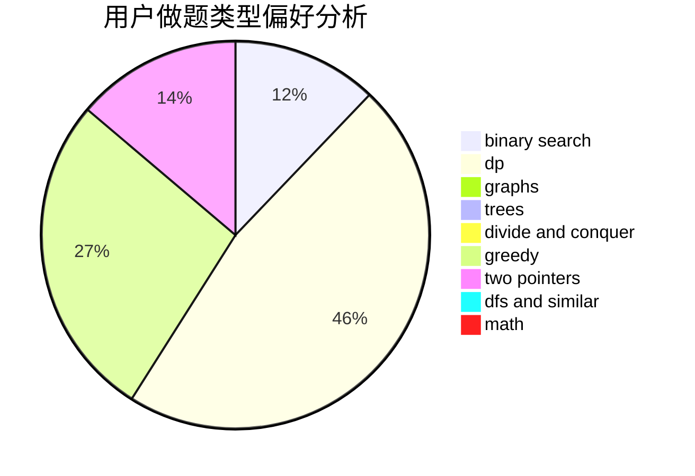

# wzc1995

<!-- tabs:start -->

#### **用户提交结果分析**

#### **用户做题类型偏好分析**

<!-- tabs:end -->
# 推荐题目
[963C](https://codeforces.com/contest/963/problem/C)
[323C](https://codeforces.com/contest/323/problem/C)
[431E](https://codeforces.com/contest/431/problem/E)
[1162C](https://codeforces.com/contest/1162/problem/C)
[363B](https://codeforces.com/contest/363/problem/B)
[1090B](https://codeforces.com/contest/1090/problem/B)
[553A](https://codeforces.com/contest/553/problem/A)
[1345F](https://codeforces.com/contest/1345/problem/F)
[295A](https://codeforces.com/contest/295/problem/A)
[820D](https://codeforces.com/contest/820/problem/D)
