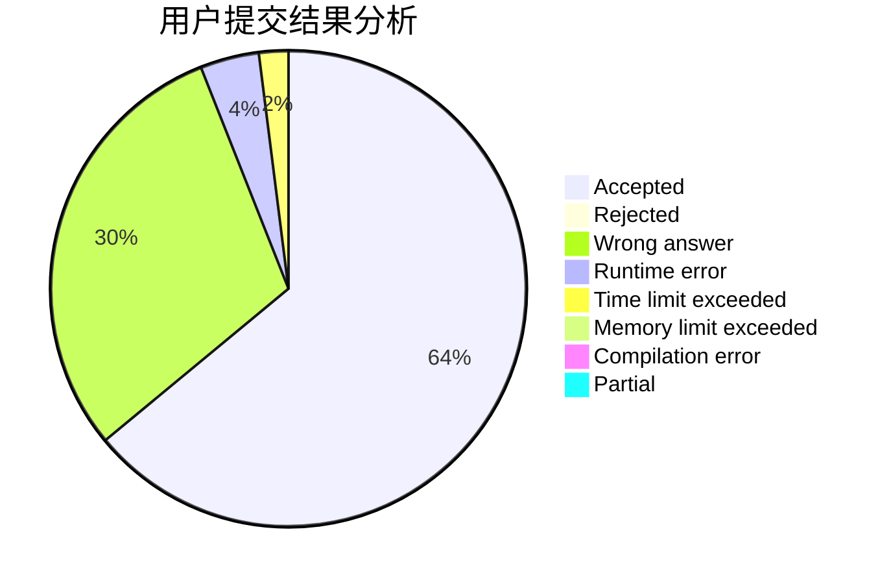
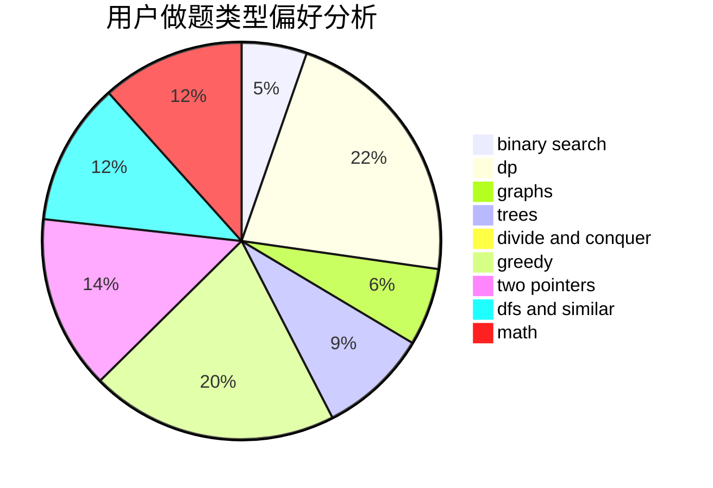

# wzcjj

<!-- tabs:start -->

#### **用户提交结果分析**

#### **用户做题类型偏好分析**

<!-- tabs:end -->
# 推荐题目
[314C](https://codeforces.com/contest/314/problem/C)
[1257E](https://codeforces.com/contest/1257/problem/E)
[520A](https://codeforces.com/contest/520/problem/A)
[566G](https://codeforces.com/contest/566/problem/G)
[219A](https://codeforces.com/contest/219/problem/A)
[765F](https://codeforces.com/contest/765/problem/F)
[462E](https://codeforces.com/contest/462/problem/E)
[112A](https://codeforces.com/contest/112/problem/A)
[1113D](https://codeforces.com/contest/1113/problem/D)
[637B](https://codeforces.com/contest/637/problem/B)
