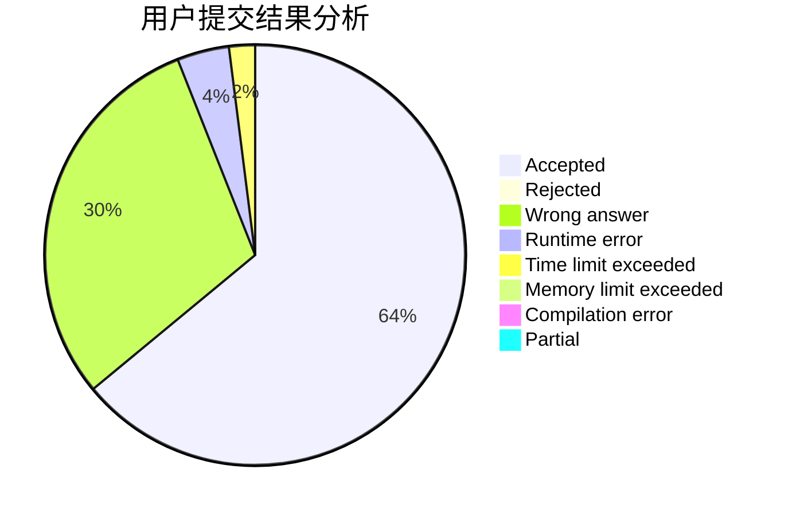
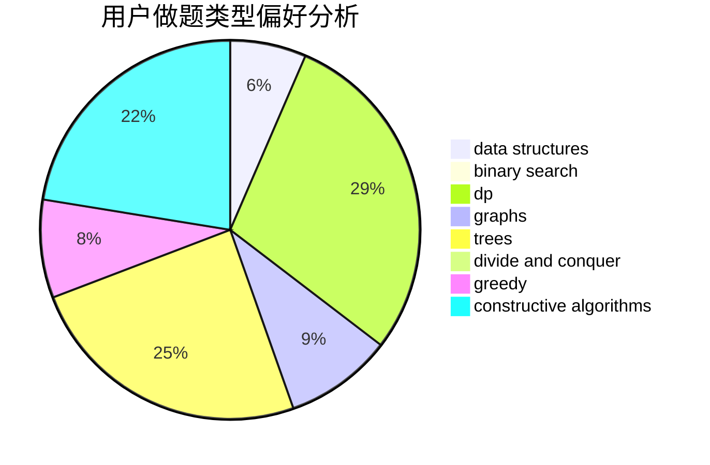
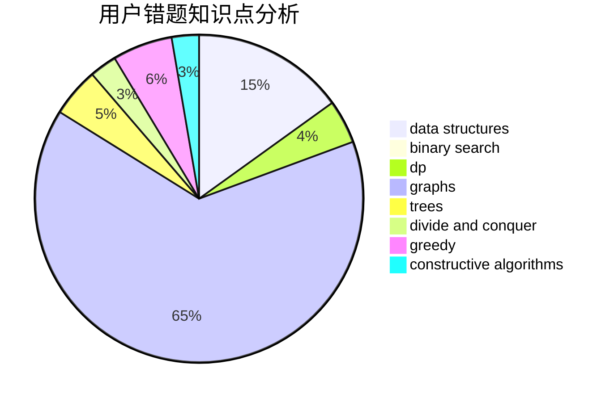

# wzcjj

<!-- tabs:start -->

#### **用户提交结果分析**

#### **用户做题类型偏好分析**

#### **用户错题知识点分析**

<!-- tabs:end -->
# 推荐题目
[314C](https://codeforces.com/contest/314/problem/C)		data structures,
                        dp		  
[1257E](https://codeforces.com/contest/1257/problem/E)		data structures,
                        dp,
                        greedy		  
[520A](https://codeforces.com/contest/520/problem/A)		implementation,
                        strings		  
[566G](https://codeforces.com/contest/566/problem/G)		geometry		  
[219A](https://codeforces.com/contest/219/problem/A)		implementation,
                        strings		  
[765F](https://codeforces.com/contest/765/problem/F)		data structures		  
[462E](https://codeforces.com/contest/462/problem/E)		dsu,graphs,sortings,trees		  
[112A](https://codeforces.com/contest/112/problem/A)		implementation,
                        strings		  
[1113D](https://codeforces.com/contest/1113/problem/D)		dsu,graphs,sortings,trees		  
[637B](https://codeforces.com/contest/637/problem/B)		*special problem,
                        binary search,
                        constructive algorithms,
                        data structures,
                        sortings		  
