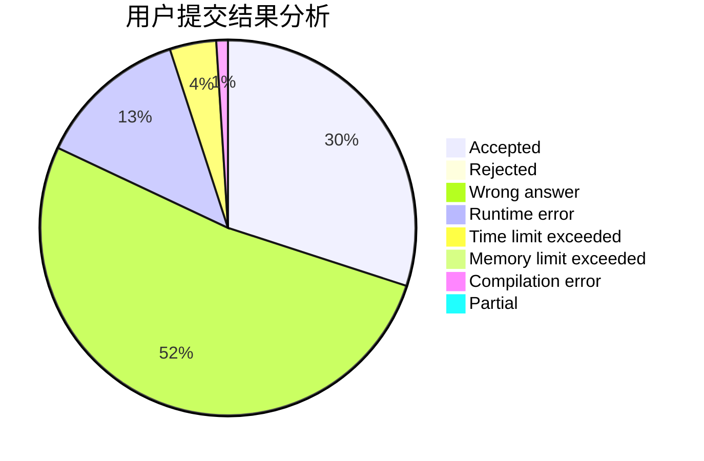
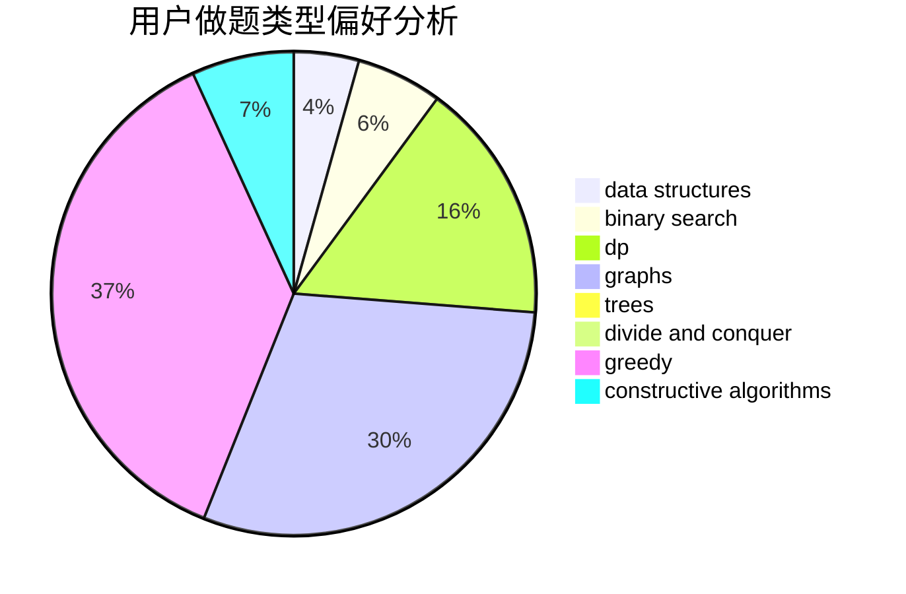
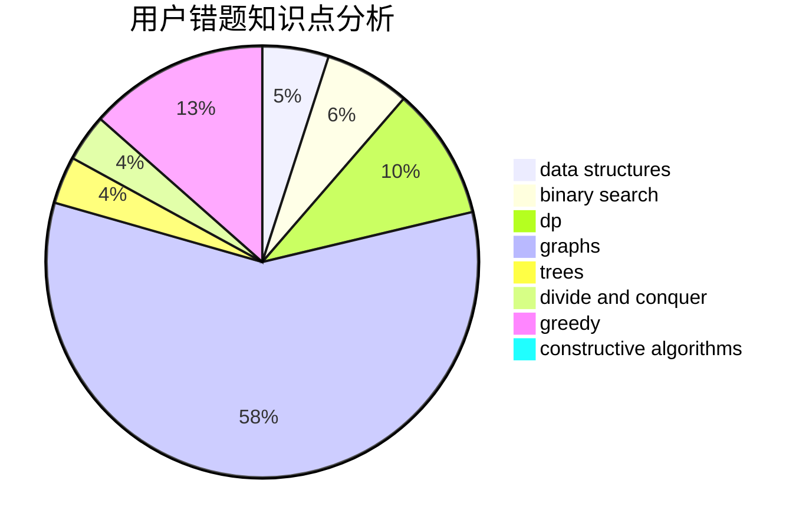

# Cansult

<!-- tabs:start -->

#### **用户提交结果分析**

#### **用户做题类型偏好分析**

#### **用户错题知识点分析**

<!-- tabs:end -->
# 推荐题目
[668C](https://codeforces.com/contest/668/problem/C)		dsu,graphs,sortings,trees		  
[279B](https://codeforces.com/contest/279/problem/B)		binary search,
                        brute force,
                        implementation,
                        two pointers		  
[1191A](https://codeforces.com/contest/1191/problem/A)		brute force		  
[1082B](https://codeforces.com/contest/1082/problem/B)		greedy		  
[665F](https://codeforces.com/contest/665/problem/F)		data structures,
                        dp,
                        math,
                        number theory,
                        sortings,
                        two pointers		  
[180C](https://codeforces.com/contest/180/problem/C)		dp		  
[667B](https://codeforces.com/contest/667/problem/B)		constructive algorithms,
                        geometry		  
[1494F](https://codeforces.com/contest/1494/problem/F)		brute force,
                        constructive algorithms,
                        dfs and similar,
                        graphs,
                        implementation		  
[621B](https://codeforces.com/contest/621/problem/B)		combinatorics,
                        implementation		  
[540A](https://codeforces.com/contest/540/problem/A)		implementation		  
