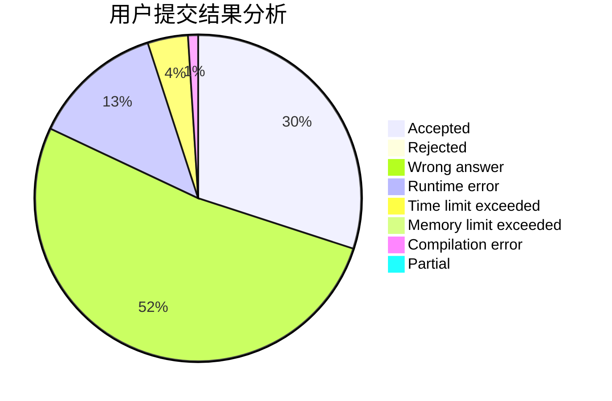
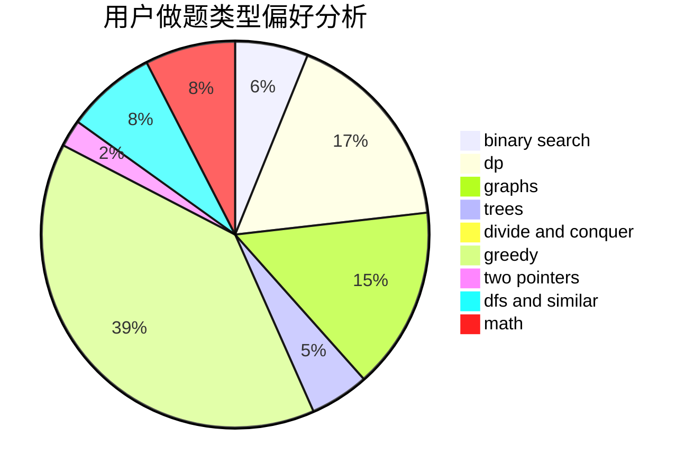

# Cansult

<!-- tabs:start -->

#### **用户提交结果分析**

#### **用户做题类型偏好分析**

<!-- tabs:end -->
# 推荐题目
[668C](https://codeforces.com/contest/668/problem/C)
[279B](https://codeforces.com/contest/279/problem/B)
[1191A](https://codeforces.com/contest/1191/problem/A)
[1082B](https://codeforces.com/contest/1082/problem/B)
[665F](https://codeforces.com/contest/665/problem/F)
[180C](https://codeforces.com/contest/180/problem/C)
[667B](https://codeforces.com/contest/667/problem/B)
[1494F](https://codeforces.com/contest/1494/problem/F)
[621B](https://codeforces.com/contest/621/problem/B)
[540A](https://codeforces.com/contest/540/problem/A)
