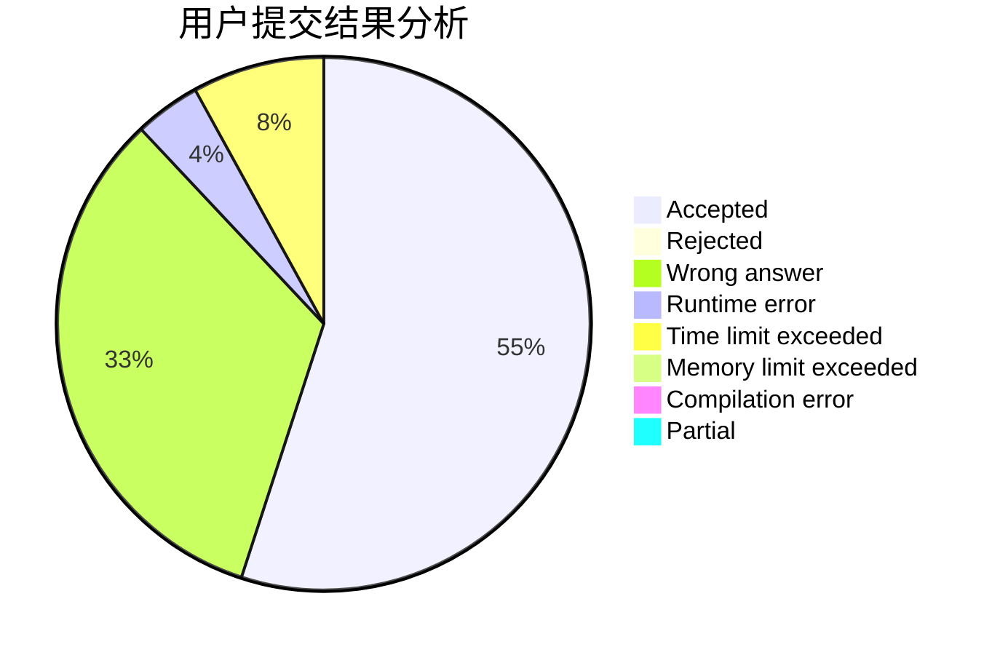
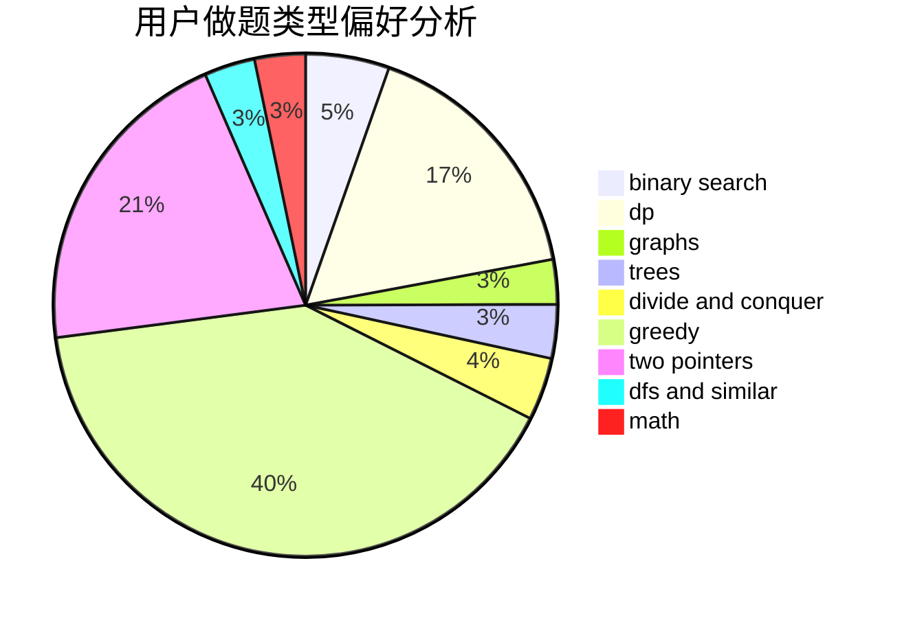

# wzh520wzh

<!-- tabs:start -->

#### **用户提交结果分析**

#### **用户做题类型偏好分析**

<!-- tabs:end -->
# 推荐题目
[952E](https://codeforces.com/contest/952/problem/E)
[1329C](https://codeforces.com/contest/1329/problem/C)
[1360A](https://codeforces.com/contest/1360/problem/A)
[957E](https://codeforces.com/contest/957/problem/E)
[218B](https://codeforces.com/contest/218/problem/B)
[295A](https://codeforces.com/contest/295/problem/A)
[1188E](https://codeforces.com/contest/1188/problem/E)
[1131B](https://codeforces.com/contest/1131/problem/B)
[870B](https://codeforces.com/contest/870/problem/B)
[279D](https://codeforces.com/contest/279/problem/D)
