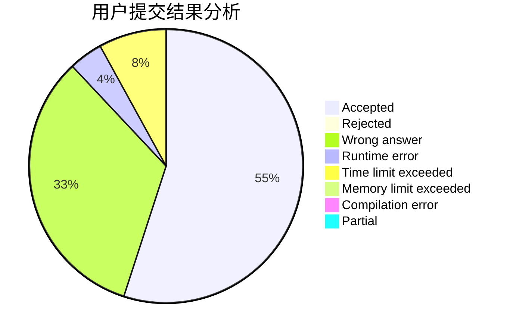
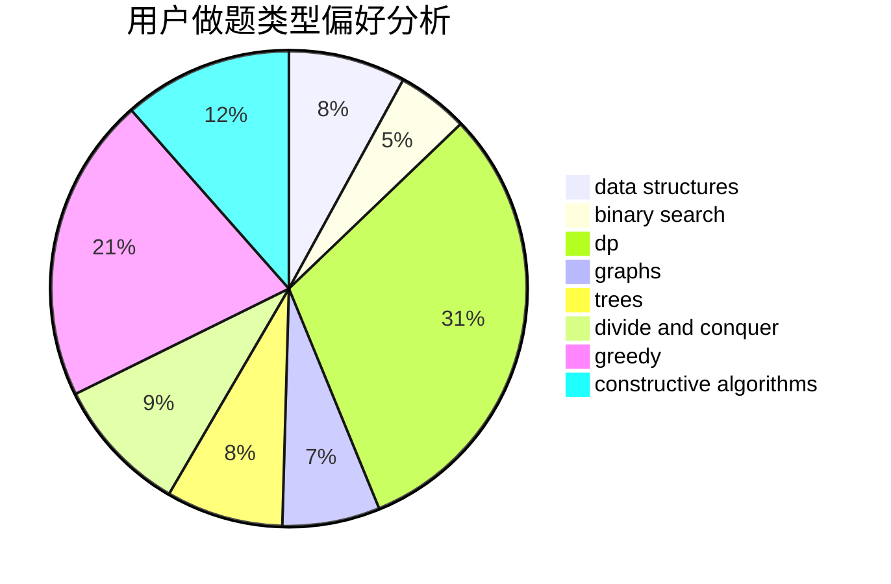
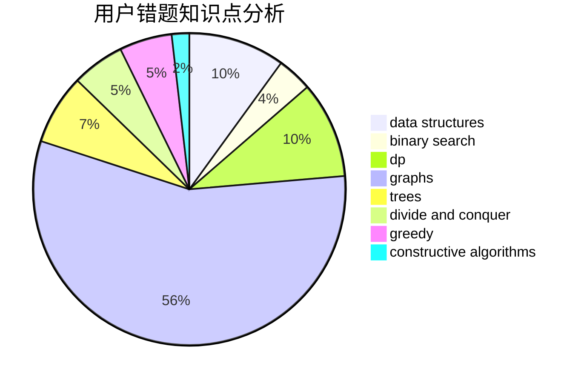

# wzh520wzh

<!-- tabs:start -->

#### **用户提交结果分析**

#### **用户做题类型偏好分析**

#### **用户错题知识点分析**

<!-- tabs:end -->
# 推荐题目
[952E](https://codeforces.com/contest/952/problem/E)		nan		  
[1329C](https://codeforces.com/contest/1329/problem/C)		constructive algorithms,
                        data structures,
                        greedy,
                        implementation		  
[1360A](https://codeforces.com/contest/1360/problem/A)		greedy,
                        math		  
[957E](https://codeforces.com/contest/957/problem/E)		dsu,graphs,sortings,trees		  
[218B](https://codeforces.com/contest/218/problem/B)		implementation		  
[295A](https://codeforces.com/contest/295/problem/A)		data structures,
                        implementation		  
[1188E](https://codeforces.com/contest/1188/problem/E)		combinatorics		  
[1131B](https://codeforces.com/contest/1131/problem/B)		greedy,
                        implementation		  
[870B](https://codeforces.com/contest/870/problem/B)		greedy		  
[279D](https://codeforces.com/contest/279/problem/D)		bitmasks,
                        dp		  
