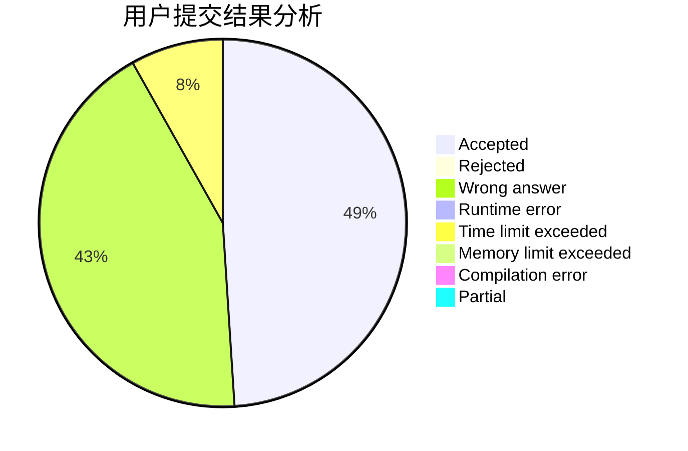
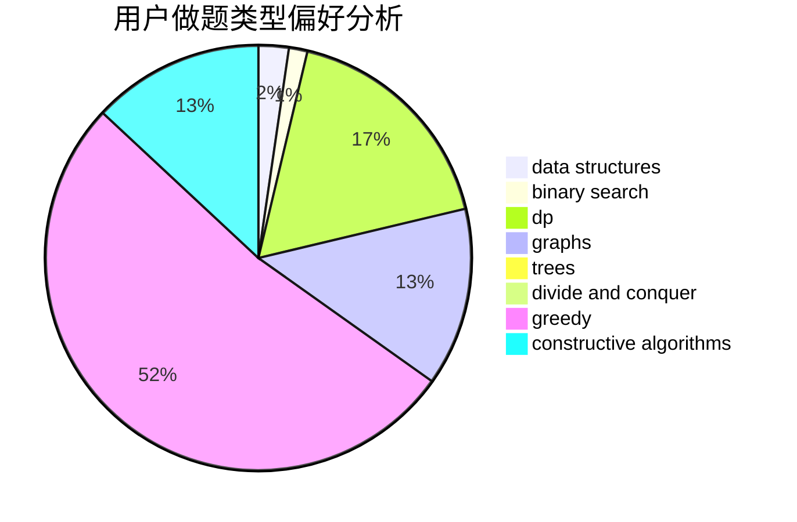
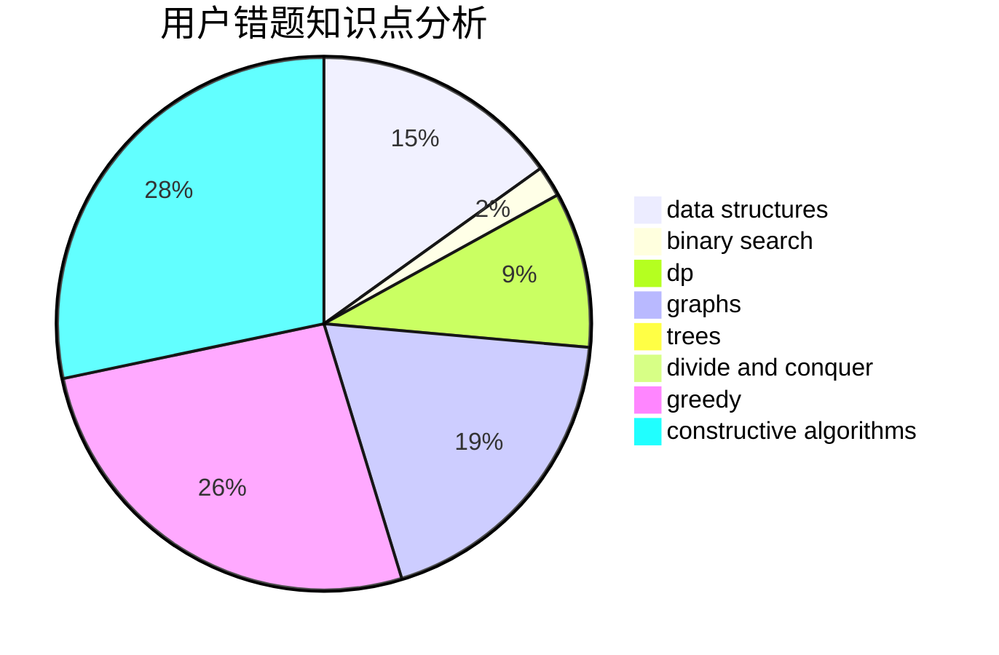

# wzsCD

<!-- tabs:start -->

#### **用户提交结果分析**

#### **用户做题类型偏好分析**

#### **用户错题知识点分析**

<!-- tabs:end -->
# 推荐题目
[1207B](https://codeforces.com/contest/1207/problem/B)		constructive algorithms,
                        greedy,
                        implementation		  
[928B](https://codeforces.com/contest/928/problem/B)		*special problem,
                        dp		  
[1033G](https://codeforces.com/contest/1033/problem/G)		games		  
[1425A](https://codeforces.com/contest/1425/problem/A)		games,
                        greedy		  
[725F](https://codeforces.com/contest/725/problem/F)		games,
                        greedy		  
[159D](https://codeforces.com/contest/159/problem/D)		*special problem,
                        brute force,
                        dp,
                        strings		  
[597B](https://codeforces.com/contest/597/problem/B)		dp,
                        greedy,
                        sortings		  
[618A](https://codeforces.com/contest/618/problem/A)		implementation		  
[101B](https://codeforces.com/contest/101/problem/B)		binary search,
                        data structures,
                        dp		  
[977D](https://codeforces.com/contest/977/problem/D)		dfs and similar,
                        math,
                        sortings		  
