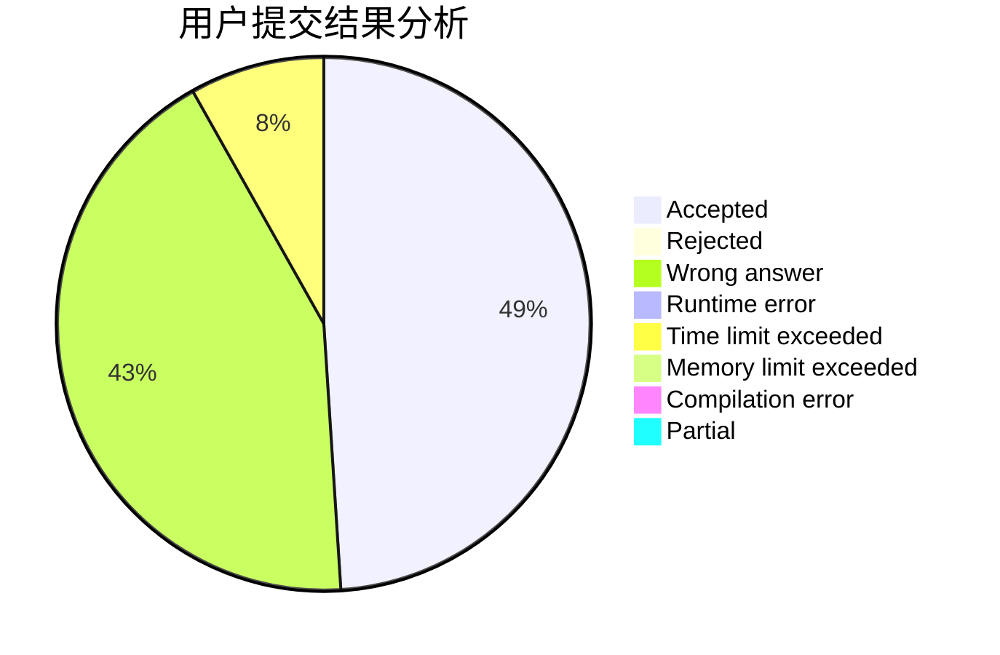
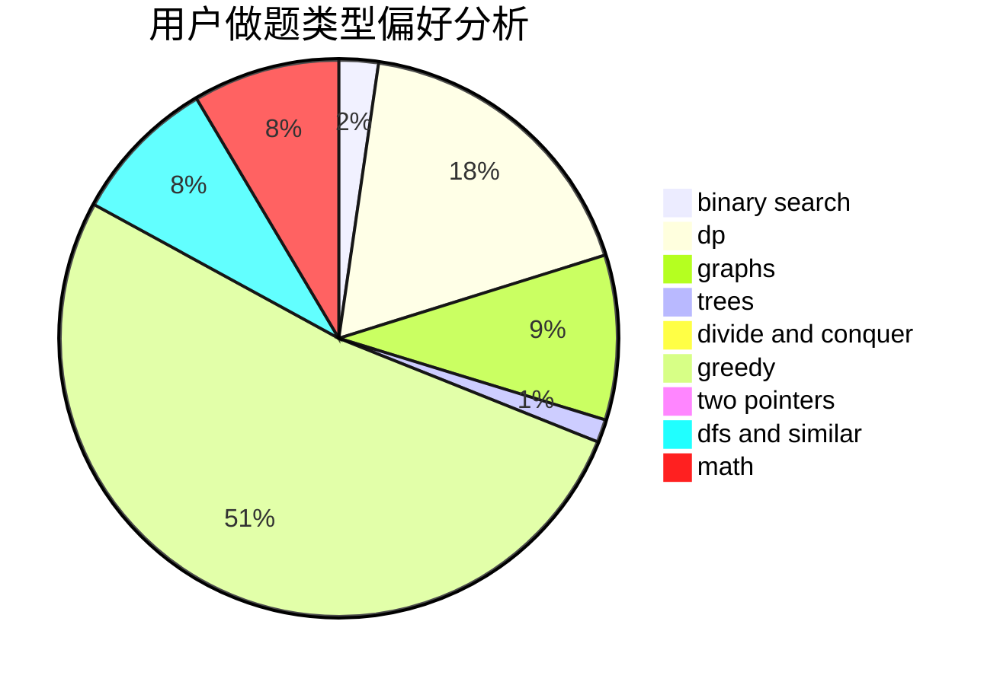

# wzsCD

<!-- tabs:start -->

#### **用户提交结果分析**

#### **用户做题类型偏好分析**

<!-- tabs:end -->
# 推荐题目
[1207B](https://codeforces.com/contest/1207/problem/B)
[928B](https://codeforces.com/contest/928/problem/B)
[1033G](https://codeforces.com/contest/1033/problem/G)
[1425A](https://codeforces.com/contest/1425/problem/A)
[725F](https://codeforces.com/contest/725/problem/F)
[159D](https://codeforces.com/contest/159/problem/D)
[597B](https://codeforces.com/contest/597/problem/B)
[618A](https://codeforces.com/contest/618/problem/A)
[101B](https://codeforces.com/contest/101/problem/B)
[977D](https://codeforces.com/contest/977/problem/D)
