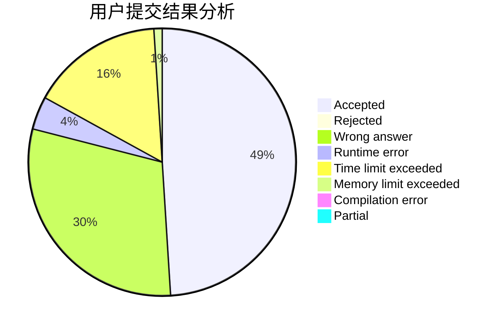
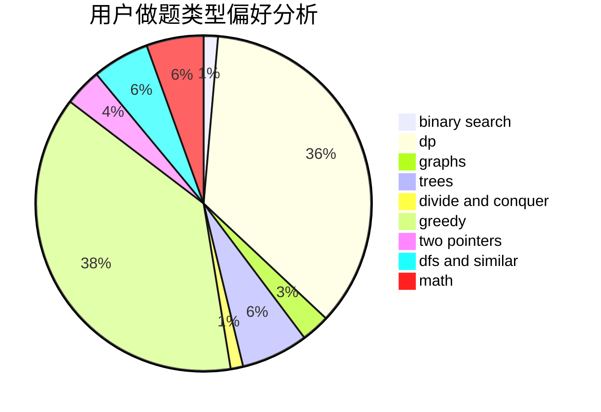

# wzxx_

<!-- tabs:start -->

#### **用户提交结果分析**

#### **用户做题类型偏好分析**

<!-- tabs:end -->
# 推荐题目
[1250B](https://codeforces.com/contest/1250/problem/B)
[634B](https://codeforces.com/contest/634/problem/B)
[1379E](https://codeforces.com/contest/1379/problem/E)
[758F](https://codeforces.com/contest/758/problem/F)
[568A](https://codeforces.com/contest/568/problem/A)
[903A](https://codeforces.com/contest/903/problem/A)
[834B](https://codeforces.com/contest/834/problem/B)
[1078C](https://codeforces.com/contest/1078/problem/C)
[75D](https://codeforces.com/contest/75/problem/D)
[474C](https://codeforces.com/contest/474/problem/C)
