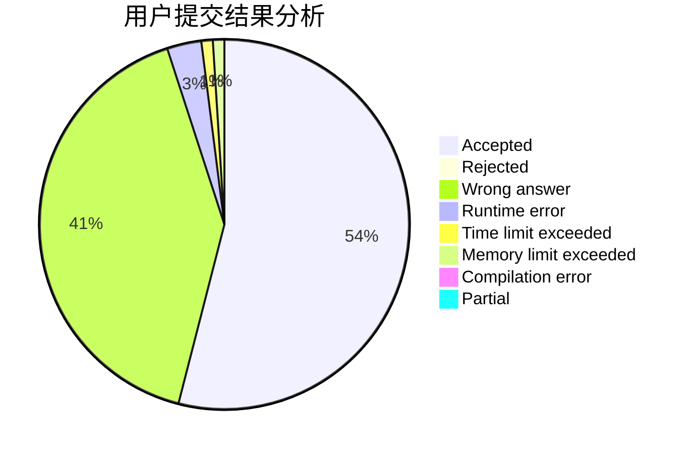
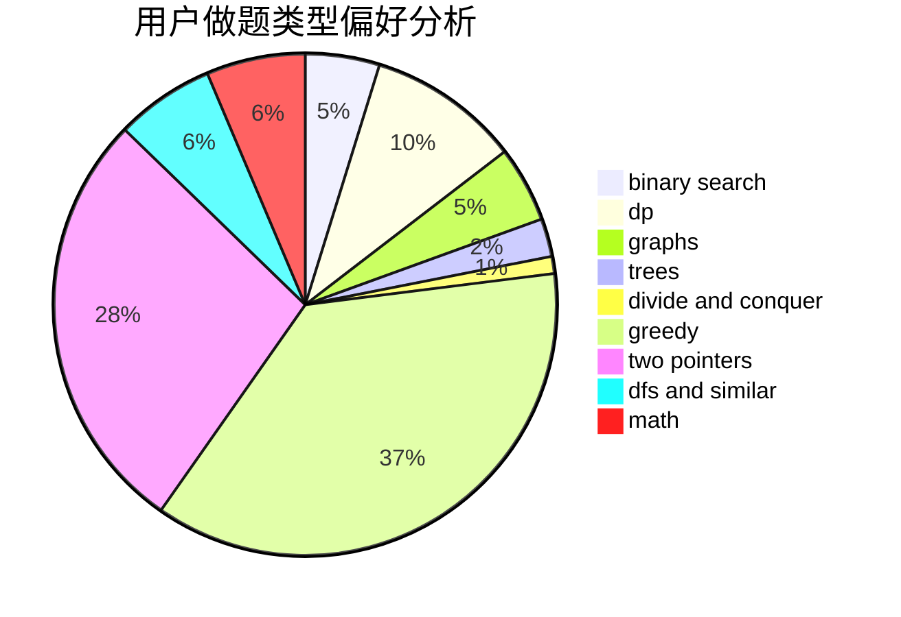

# xajd1906

<!-- tabs:start -->

#### **用户提交结果分析**

#### **用户做题类型偏好分析**

<!-- tabs:end -->
# 推荐题目
[869B](https://codeforces.com/contest/869/problem/B)
[729D](https://codeforces.com/contest/729/problem/D)
[732B](https://codeforces.com/contest/732/problem/B)
[405B](https://codeforces.com/contest/405/problem/B)
[808F](https://codeforces.com/contest/808/problem/F)
[669C](https://codeforces.com/contest/669/problem/C)
[1083A](https://codeforces.com/contest/1083/problem/A)
[98C](https://codeforces.com/contest/98/problem/C)
[230B](https://codeforces.com/contest/230/problem/B)
[93C](https://codeforces.com/contest/93/problem/C)
