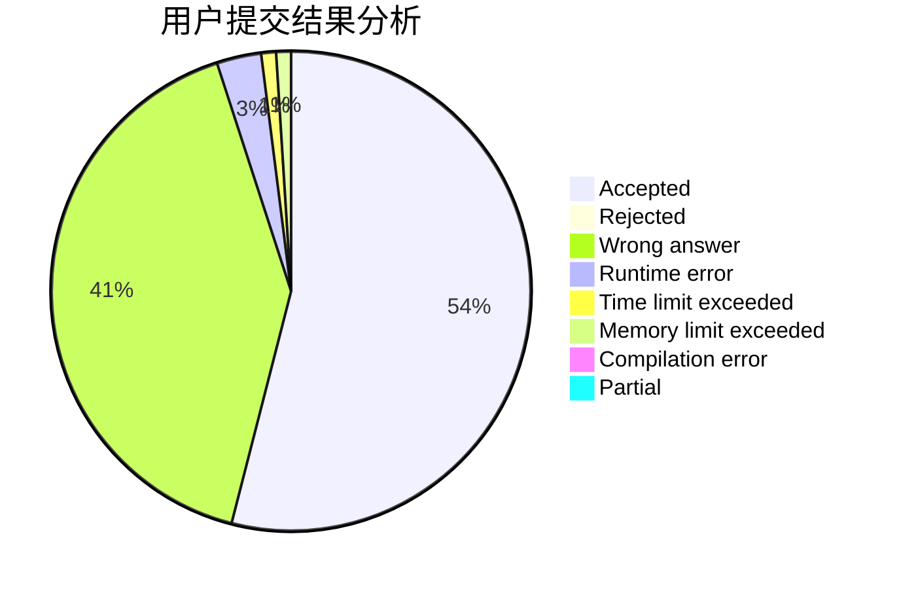
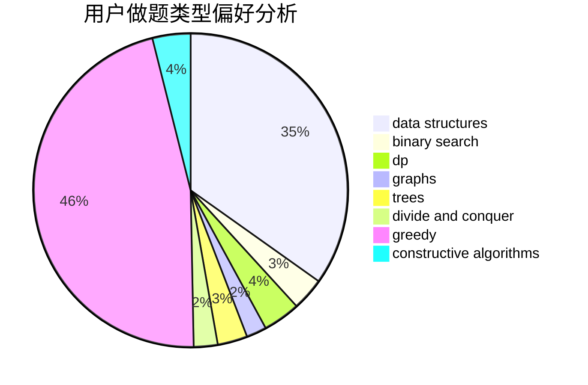
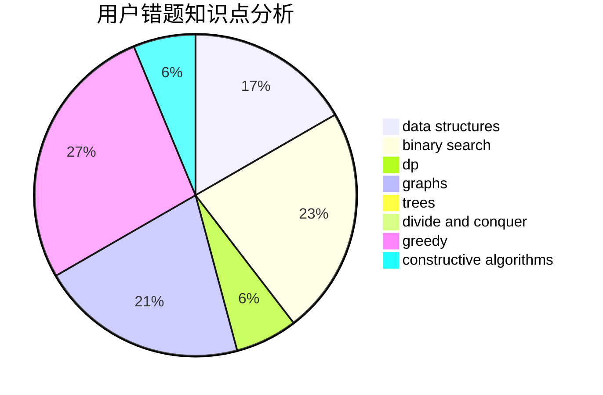

# xajd1906

<!-- tabs:start -->

#### **用户提交结果分析**

#### **用户做题类型偏好分析**

#### **用户错题知识点分析**

<!-- tabs:end -->
# 推荐题目
[850C](https://codeforces.com/contest/850/problem/C)		bitmasks,
                        dp,
                        games		  
[709C](https://codeforces.com/contest/709/problem/C)		dsu,graphs,sortings,trees		  
[713A](https://codeforces.com/contest/713/problem/A)		data structures,
                        implementation		  
[377A](https://codeforces.com/contest/377/problem/A)		dfs and similar		  
[793D](https://codeforces.com/contest/793/problem/D)		dp,
                        graphs,
                        shortest paths		  
[639E](https://codeforces.com/contest/639/problem/E)		binary search,
                        greedy,
                        math,
                        sortings		  
[1082E](https://codeforces.com/contest/1082/problem/E)		binary search,
                        dp,
                        greedy		  
[975D](https://codeforces.com/contest/975/problem/D)		geometry,
                        math		  
[208D](https://codeforces.com/contest/208/problem/D)		implementation		  
[91A](https://codeforces.com/contest/91/problem/A)		greedy,
                        strings		  
