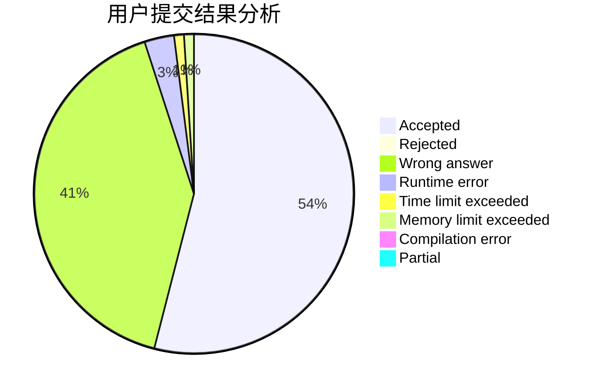
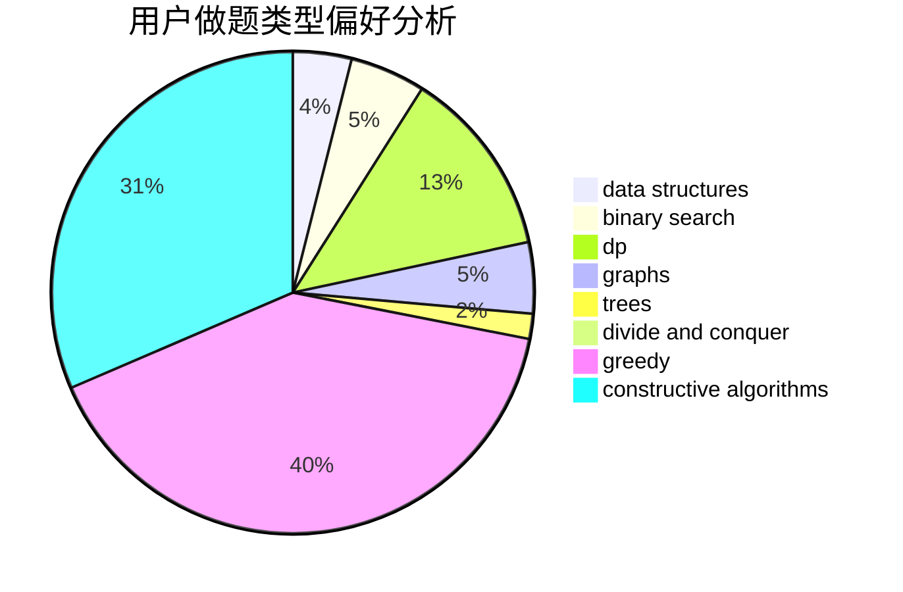
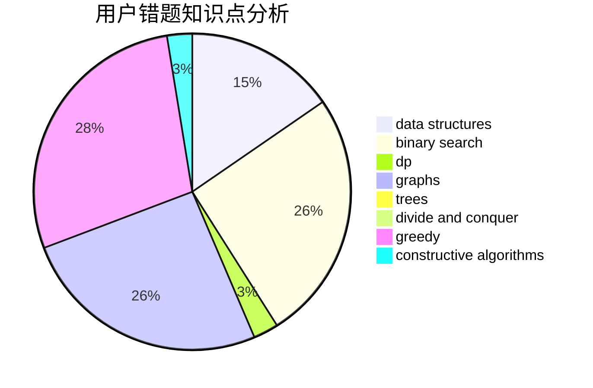

# xajd1906

<!-- tabs:start -->

#### **用户提交结果分析**

#### **用户做题类型偏好分析**

#### **用户错题知识点分析**

<!-- tabs:end -->
# 推荐题目
[869B](https://codeforces.com/contest/869/problem/B)		math		  
[729D](https://codeforces.com/contest/729/problem/D)		constructive algorithms,
                        greedy,
                        math		  
[732B](https://codeforces.com/contest/732/problem/B)		dp,
                        greedy		  
[405B](https://codeforces.com/contest/405/problem/B)		nan		  
[808F](https://codeforces.com/contest/808/problem/F)		binary search,
                        flows,
                        graphs		  
[669C](https://codeforces.com/contest/669/problem/C)		dsu,graphs,sortings,trees		  
[1083A](https://codeforces.com/contest/1083/problem/A)		data structures,
                        dp,
                        trees		  
[98C](https://codeforces.com/contest/98/problem/C)		geometry,
                        ternary search		  
[230B](https://codeforces.com/contest/230/problem/B)		binary search,
                        implementation,
                        math,
                        number theory		  
[93C](https://codeforces.com/contest/93/problem/C)		brute force,
                        implementation		  
