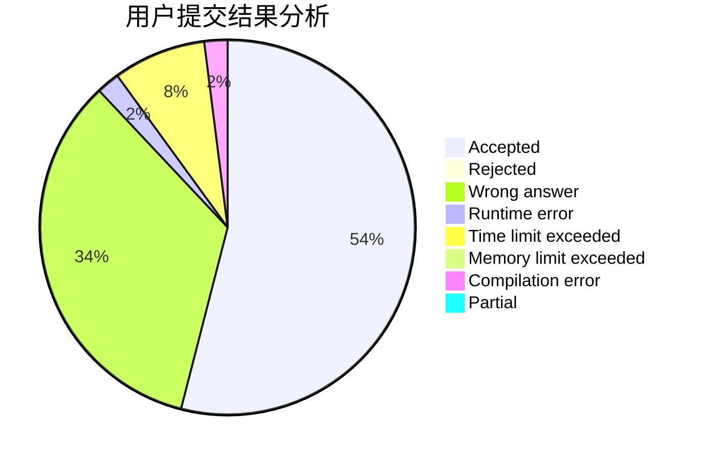
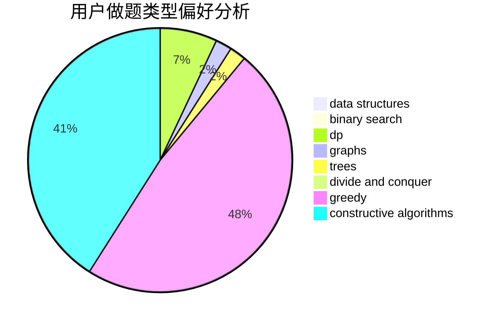
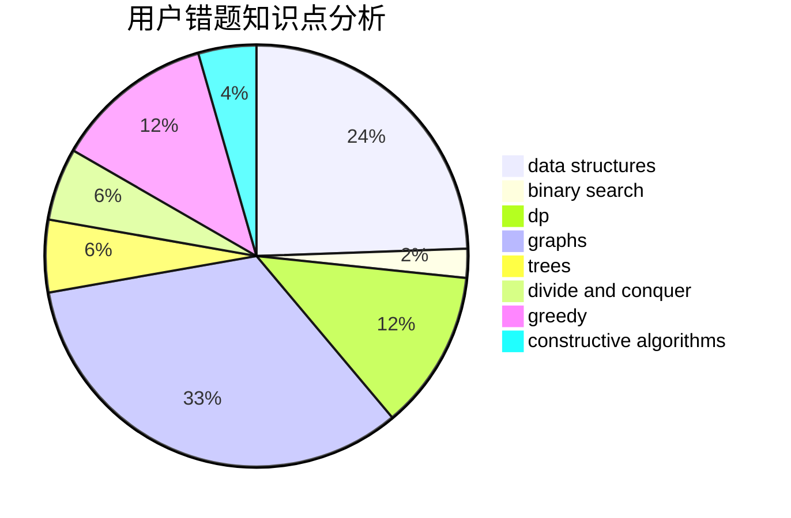

# xaohu

<!-- tabs:start -->

#### **用户提交结果分析**

#### **用户做题类型偏好分析**

#### **用户错题知识点分析**

<!-- tabs:end -->
# 推荐题目
[1457D](https://codeforces.com/contest/1457/problem/D)		dsu,graphs,sortings,trees		  
[1070E](https://codeforces.com/contest/1070/problem/E)		binary search,
                        data structures		  
[205B](https://codeforces.com/contest/205/problem/B)		brute force,
                        greedy		  
[932C](https://codeforces.com/contest/932/problem/C)		brute force,
                        constructive algorithms		  
[442C](https://codeforces.com/contest/442/problem/C)		data structures,
                        greedy		  
[868D](https://codeforces.com/contest/868/problem/D)		bitmasks,
                        brute force,
                        dp,
                        implementation,
                        strings		  
[628D](https://codeforces.com/contest/628/problem/D)		dp		  
[242E](https://codeforces.com/contest/242/problem/E)		bitmasks,
                        data structures		  
[337B](https://codeforces.com/contest/337/problem/B)		greedy,
                        math,
                        number theory		  
[1147C](https://codeforces.com/contest/1147/problem/C)		games		  
