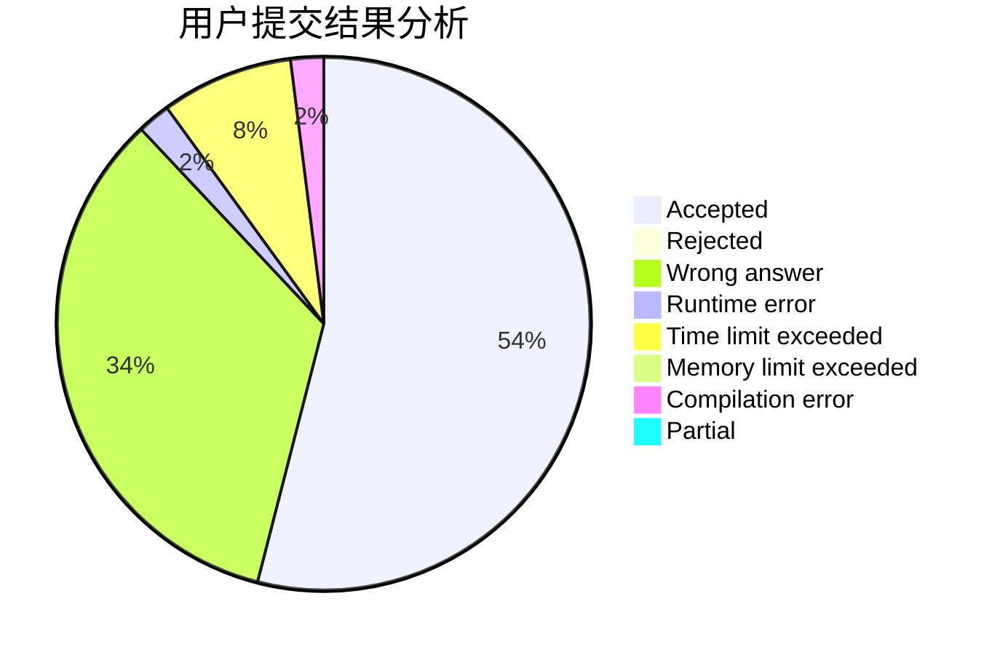
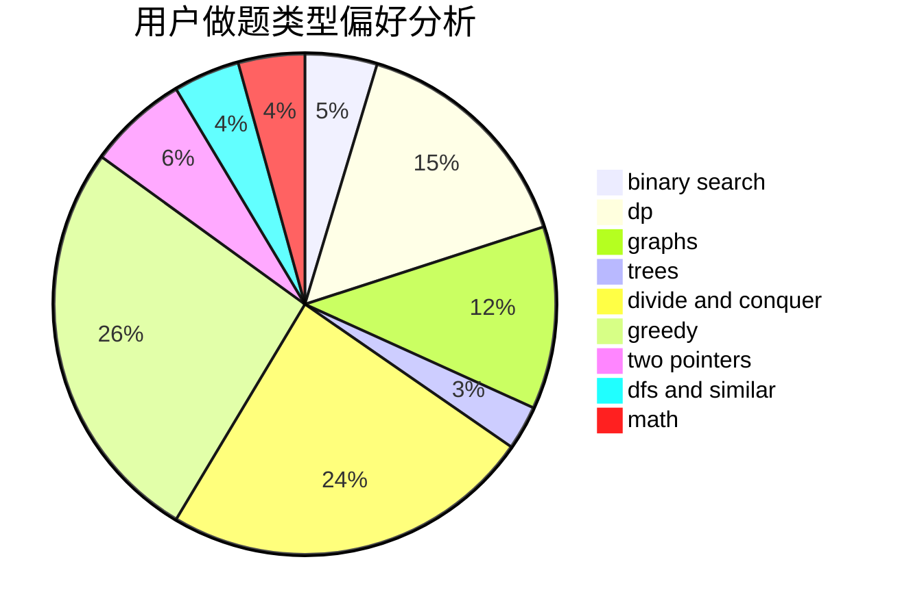

# xaohu

<!-- tabs:start -->

#### **用户提交结果分析**

#### **用户做题类型偏好分析**

<!-- tabs:end -->
# 推荐题目
[1466G](https://codeforces.com/contest/1466/problem/G)
[1070H](https://codeforces.com/contest/1070/problem/H)
[229D](https://codeforces.com/contest/229/problem/D)
[954C](https://codeforces.com/contest/954/problem/C)
[463A](https://codeforces.com/contest/463/problem/A)
[887F](https://codeforces.com/contest/887/problem/F)
[656E](https://codeforces.com/contest/656/problem/E)
[263E](https://codeforces.com/contest/263/problem/E)
[363D](https://codeforces.com/contest/363/problem/D)
[1149B](https://codeforces.com/contest/1149/problem/B)
