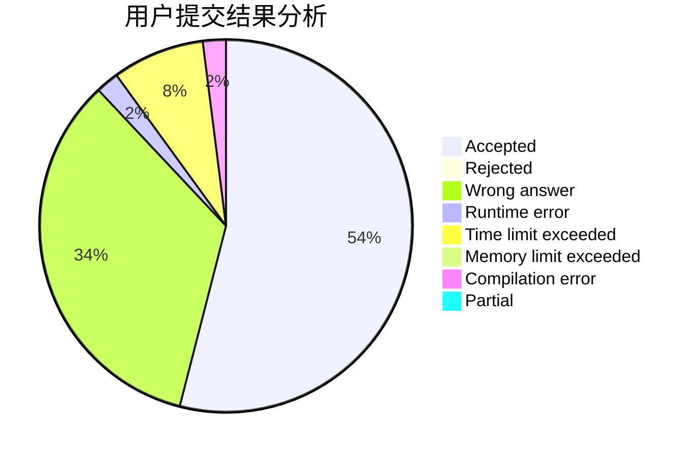
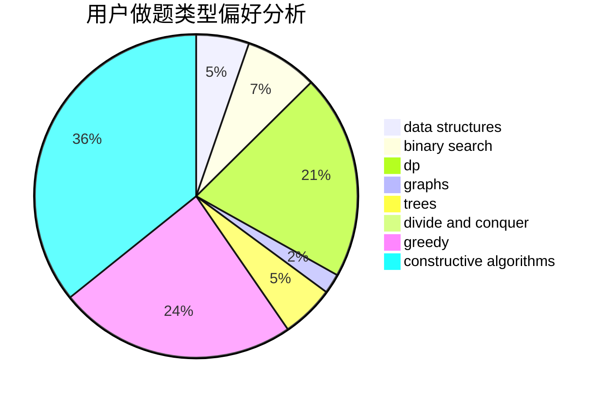
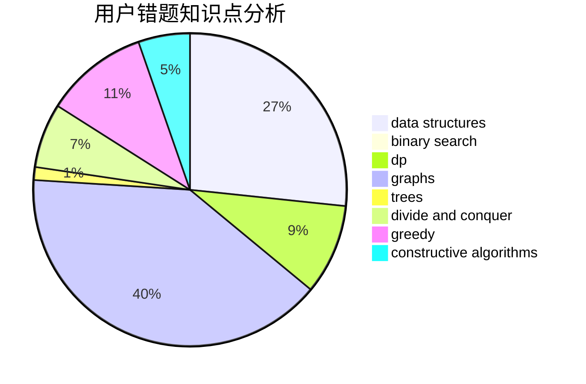

# xaohu

<!-- tabs:start -->

#### **用户提交结果分析**

#### **用户做题类型偏好分析**

#### **用户错题知识点分析**

<!-- tabs:end -->
# 推荐题目
[1466G](https://codeforces.com/contest/1466/problem/G)		combinatorics,
                        divide and conquer,
                        hashing,
                        math,
                        string suffix structures,
                        strings		  
[1070H](https://codeforces.com/contest/1070/problem/H)		brute force,
                        implementation		  
[229D](https://codeforces.com/contest/229/problem/D)		dp,
                        greedy,
                        two pointers		  
[954C](https://codeforces.com/contest/954/problem/C)		implementation		  
[463A](https://codeforces.com/contest/463/problem/A)		brute force,
                        implementation		  
[887F](https://codeforces.com/contest/887/problem/F)		greedy,
                        sortings		  
[656E](https://codeforces.com/contest/656/problem/E)		*special problem		  
[263E](https://codeforces.com/contest/263/problem/E)		brute force,
                        data structures,
                        dp		  
[363D](https://codeforces.com/contest/363/problem/D)		binary search,
                        greedy		  
[1149B](https://codeforces.com/contest/1149/problem/B)		dp,
                        implementation,
                        strings		  
