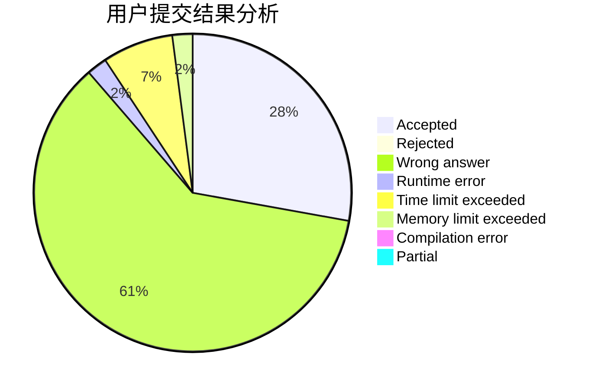
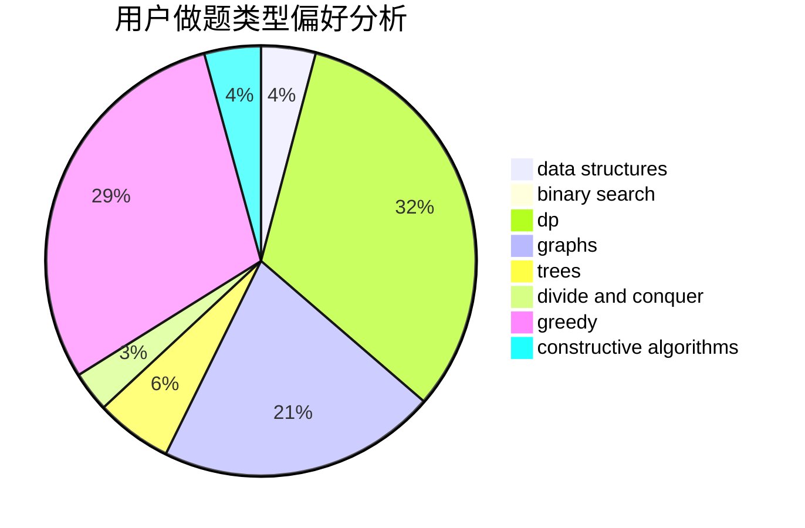

# xay5421

<!-- tabs:start -->

#### **用户提交结果分析**

#### **用户做题类型偏好分析**

#### **用户错题知识点分析**

<!-- tabs:end -->
# 推荐题目
[743E](https://codeforces.com/contest/743/problem/E)		binary search,
                        bitmasks,
                        brute force,
                        dp		  
[898D](https://codeforces.com/contest/898/problem/D)		greedy		  
[260D](https://codeforces.com/contest/260/problem/D)		constructive algorithms,
                        dsu,
                        graphs,
                        greedy,
                        trees		  
[20A](https://codeforces.com/contest/20/problem/A)		implementation		  
[429A](https://codeforces.com/contest/429/problem/A)		dfs and similar,
                        trees		  
[1473E](https://codeforces.com/contest/1473/problem/E)		graphs,
                        shortest paths		  
[738D](https://codeforces.com/contest/738/problem/D)		dsu,graphs,sortings,trees		  
[609C](https://codeforces.com/contest/609/problem/C)		implementation,
                        math		  
[935F](https://codeforces.com/contest/935/problem/F)		data structures,
                        greedy		  
[478B](https://codeforces.com/contest/478/problem/B)		combinatorics,
                        constructive algorithms,
                        greedy,
                        math		  
