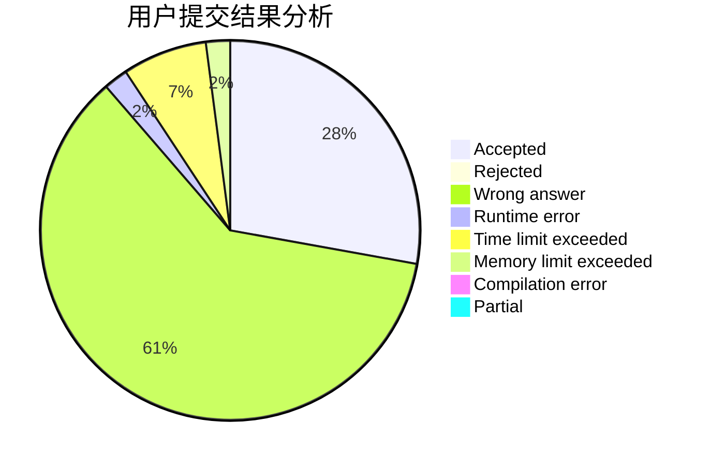
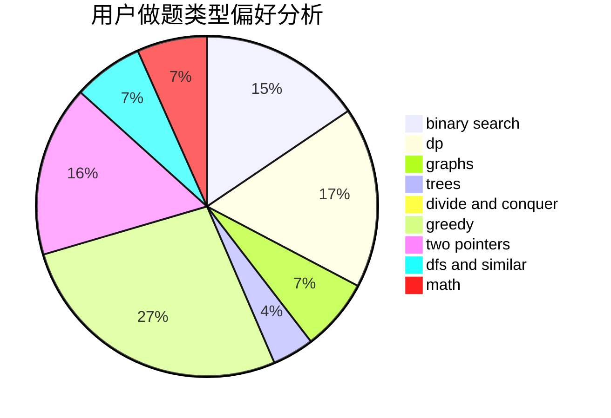

# xay5421

<!-- tabs:start -->

#### **用户提交结果分析**

#### **用户做题类型偏好分析**

<!-- tabs:end -->
# 推荐题目
[764A](https://codeforces.com/contest/764/problem/A)
[914F](https://codeforces.com/contest/914/problem/F)
[279B](https://codeforces.com/contest/279/problem/B)
[231C](https://codeforces.com/contest/231/problem/C)
[44E](https://codeforces.com/contest/44/problem/E)
[1482B](https://codeforces.com/contest/1482/problem/B)
[759D](https://codeforces.com/contest/759/problem/D)
[628C](https://codeforces.com/contest/628/problem/C)
[957E](https://codeforces.com/contest/957/problem/E)
[498B](https://codeforces.com/contest/498/problem/B)
