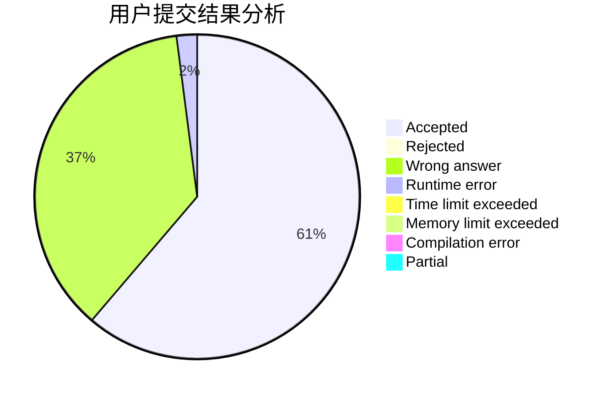
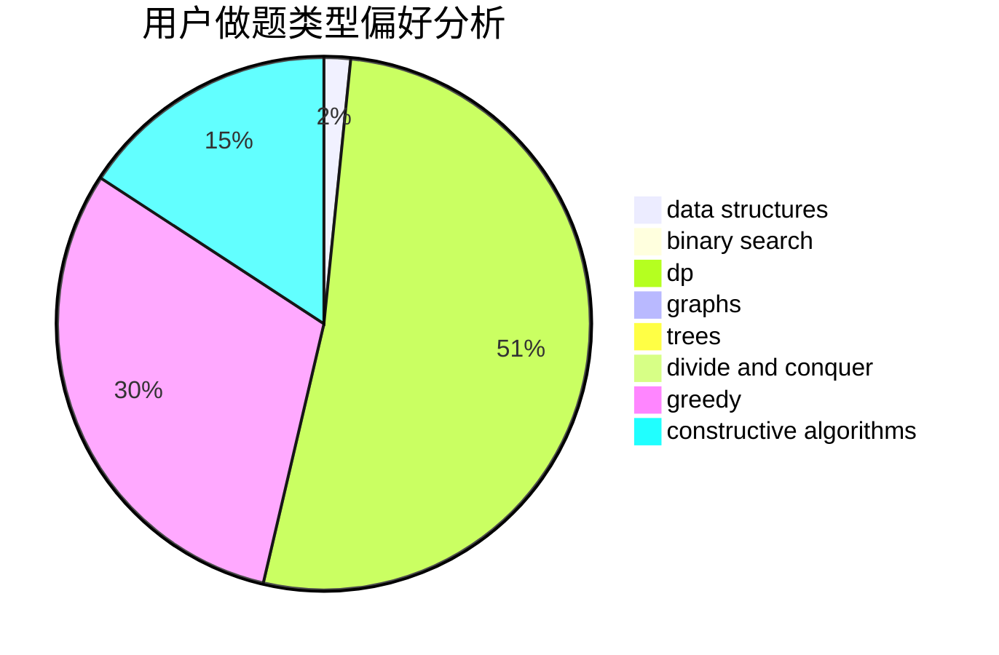
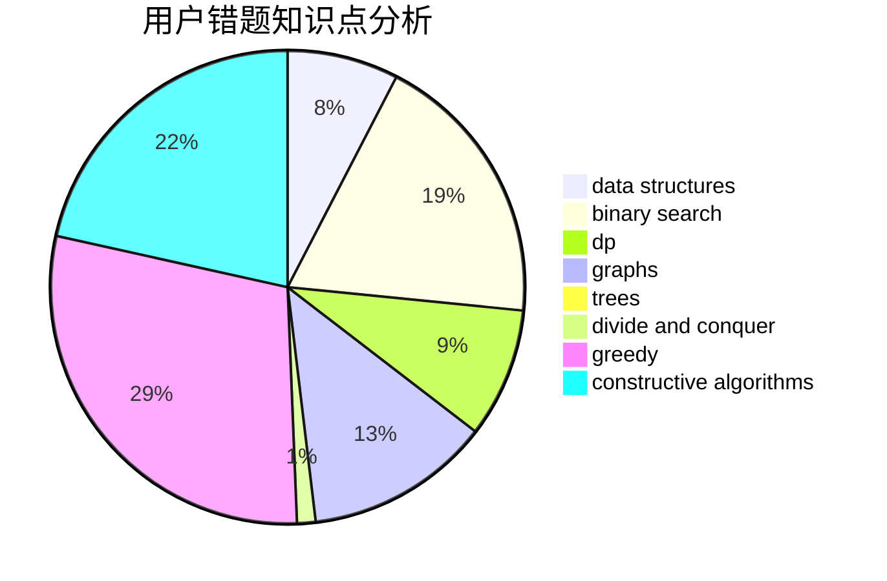

# xcatf

<!-- tabs:start -->

#### **用户提交结果分析**

#### **用户做题类型偏好分析**

#### **用户错题知识点分析**

<!-- tabs:end -->
# 推荐题目
[993B](https://codeforces.com/contest/993/problem/B)		bitmasks,
                        brute force		  
[1068C](https://codeforces.com/contest/1068/problem/C)		constructive algorithms,
                        graphs		  
[936A](https://codeforces.com/contest/936/problem/A)		binary search,
                        implementation,
                        math		  
[1431D](https://codeforces.com/contest/1431/problem/D)		*special problem,
                        greedy		  
[319A](https://codeforces.com/contest/319/problem/A)		combinatorics,
                        math		  
[995B](https://codeforces.com/contest/995/problem/B)		greedy,
                        implementation,
                        math		  
[992A](https://codeforces.com/contest/992/problem/A)		implementation,
                        sortings		  
[820C](https://codeforces.com/contest/820/problem/C)		dsu,graphs,sortings,trees		  
[1090M](https://codeforces.com/contest/1090/problem/M)		implementation		  
[1027G](https://codeforces.com/contest/1027/problem/G)		bitmasks,
                        math,
                        number theory		  
