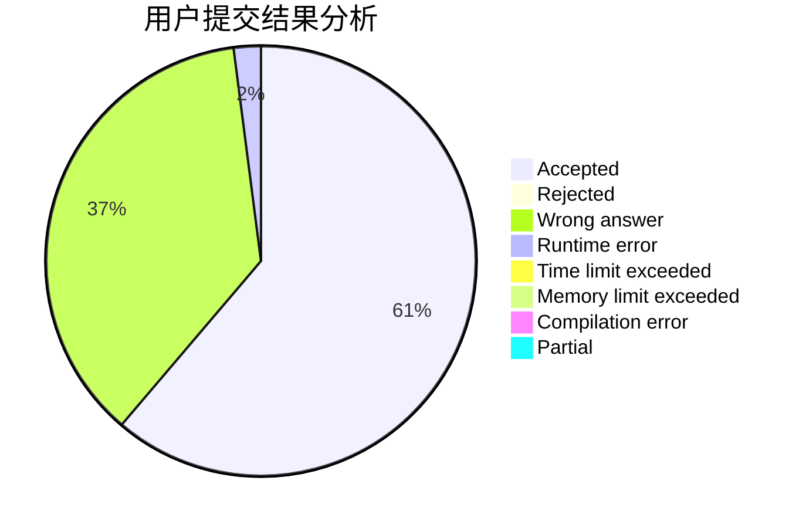
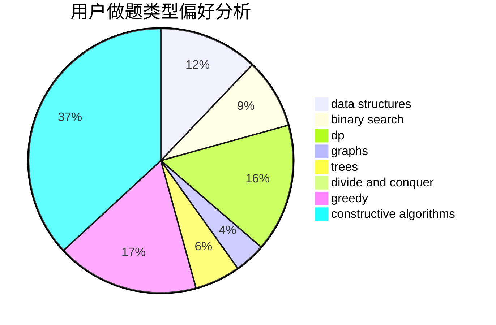
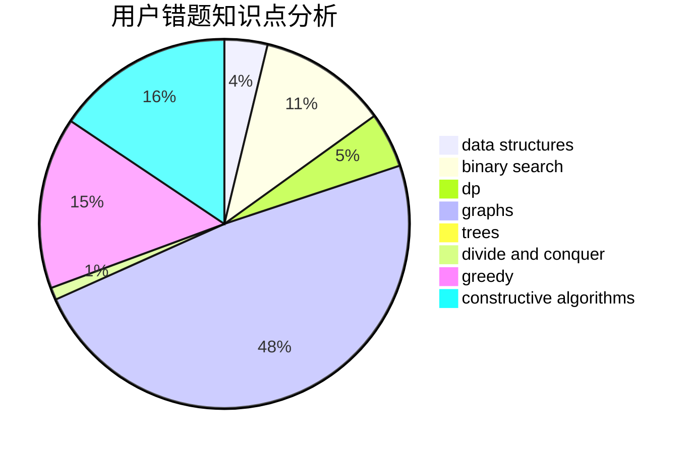

# xcatf

<!-- tabs:start -->

#### **用户提交结果分析**

#### **用户做题类型偏好分析**

#### **用户错题知识点分析**

<!-- tabs:end -->
# 推荐题目
[979B](https://codeforces.com/contest/979/problem/B)		greedy		  
[1067E](https://codeforces.com/contest/1067/problem/E)		dp,
                        graph matchings,
                        math,
                        trees		  
[916A](https://codeforces.com/contest/916/problem/A)		brute force,
                        implementation,
                        math		  
[1423I](https://codeforces.com/contest/1423/problem/I)		bitmasks		  
[300C](https://codeforces.com/contest/300/problem/C)		brute force,
                        combinatorics		  
[97E](https://codeforces.com/contest/97/problem/E)		dfs and similar,
                        dsu,
                        graphs,
                        trees		  
[978C](https://codeforces.com/contest/978/problem/C)		binary search,
                        implementation,
                        two pointers		  
[804D](https://codeforces.com/contest/804/problem/D)		binary search,
                        brute force,
                        dfs and similar,
                        dp,
                        sortings,
                        trees		  
[1090B](https://codeforces.com/contest/1090/problem/B)		nan		  
[1027D](https://codeforces.com/contest/1027/problem/D)		dfs and similar,
                        graphs		  
