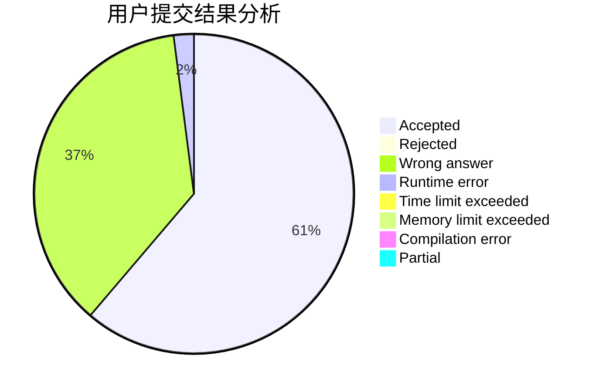
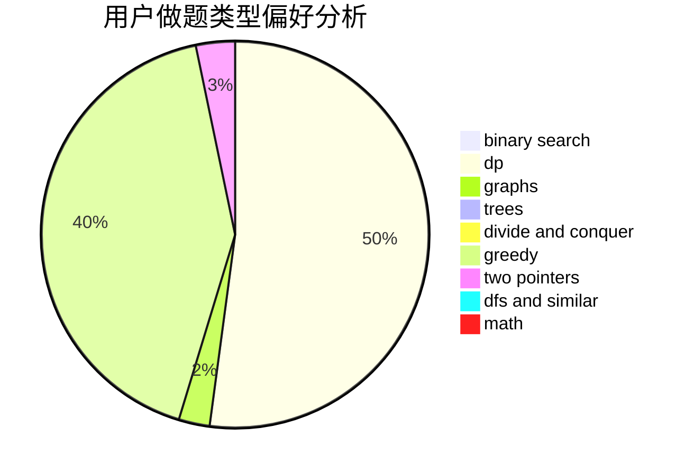

# xcatf

<!-- tabs:start -->

#### **用户提交结果分析**

#### **用户做题类型偏好分析**

<!-- tabs:end -->
# 推荐题目
[993B](https://codeforces.com/contest/993/problem/B)
[1068C](https://codeforces.com/contest/1068/problem/C)
[936A](https://codeforces.com/contest/936/problem/A)
[1431D](https://codeforces.com/contest/1431/problem/D)
[319A](https://codeforces.com/contest/319/problem/A)
[995B](https://codeforces.com/contest/995/problem/B)
[992A](https://codeforces.com/contest/992/problem/A)
[820C](https://codeforces.com/contest/820/problem/C)
[1090M](https://codeforces.com/contest/1090/problem/M)
[1027G](https://codeforces.com/contest/1027/problem/G)
