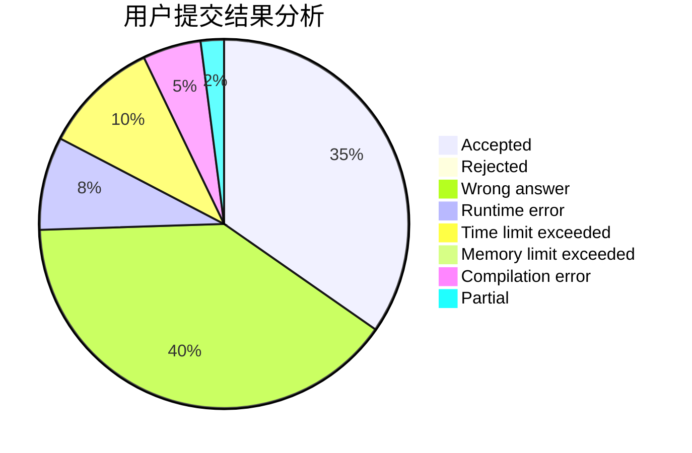
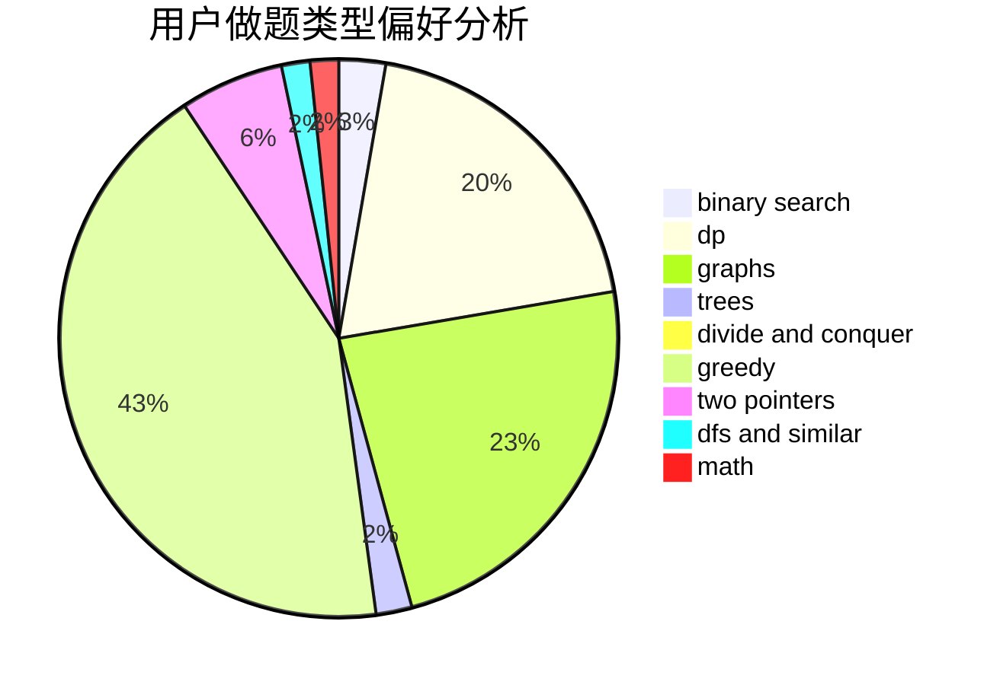

# xcxxcx

<!-- tabs:start -->

#### **用户提交结果分析**

#### **用户做题类型偏好分析**

<!-- tabs:end -->
# 推荐题目
[1487E](https://codeforces.com/contest/1487/problem/E)
[962A](https://codeforces.com/contest/962/problem/A)
[13681](https://codeforces.com/contest/1368/problem/1)
[946G](https://codeforces.com/contest/946/problem/G)
[1148B](https://codeforces.com/contest/1148/problem/B)
[996D](https://codeforces.com/contest/996/problem/D)
[1462F](https://codeforces.com/contest/1462/problem/F)
[900A](https://codeforces.com/contest/900/problem/A)
[1461F](https://codeforces.com/contest/1461/problem/F)
[960E](https://codeforces.com/contest/960/problem/E)
