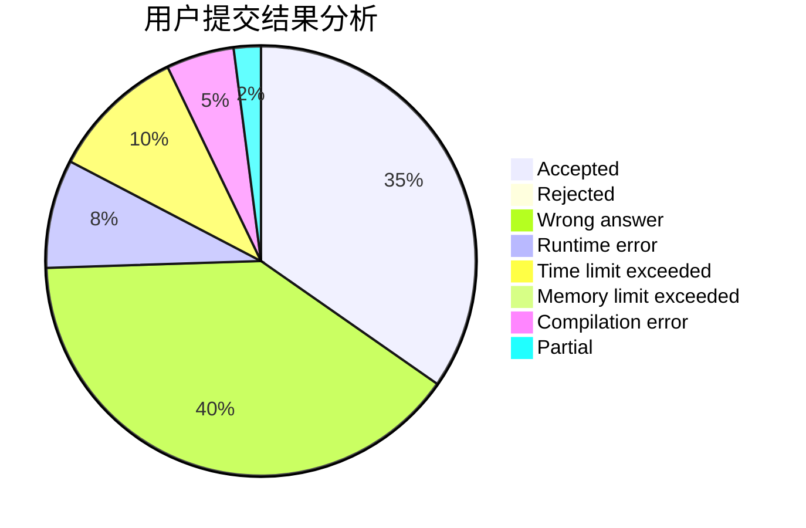
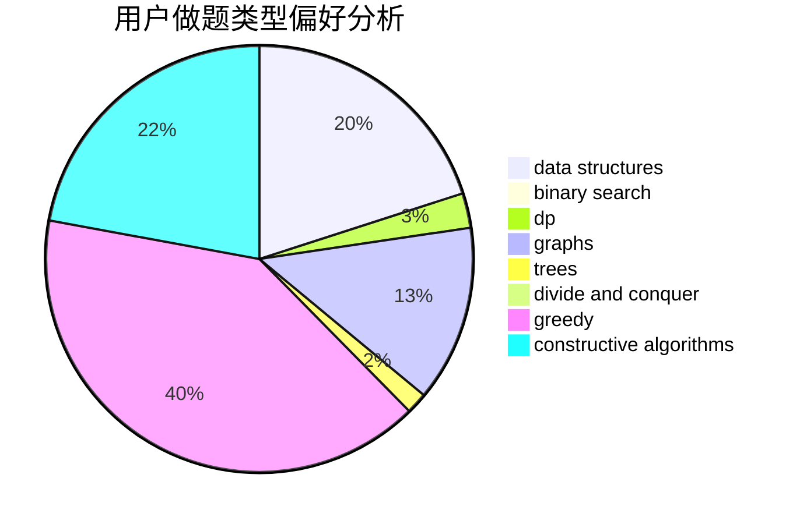
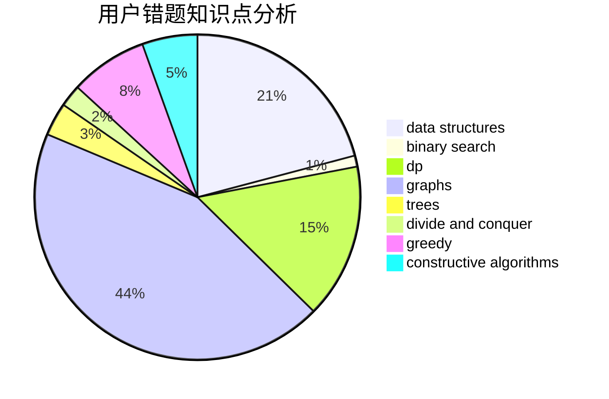

# xcxxcx

<!-- tabs:start -->

#### **用户提交结果分析**

#### **用户做题类型偏好分析**

#### **用户错题知识点分析**

<!-- tabs:end -->
# 推荐题目
[1487E](https://codeforces.com/contest/1487/problem/E)		brute force,
                        data structures,
                        graphs,
                        greedy,
                        implementation,
                        sortings,
                        two pointers		  
[962A](https://codeforces.com/contest/962/problem/A)		implementation		  
[13681](https://codeforces.com/contest/1368/problem/1)		dsu,graphs,sortings,trees		  
[946G](https://codeforces.com/contest/946/problem/G)		data structures,
                        dp		  
[1148B](https://codeforces.com/contest/1148/problem/B)		binary search,
                        brute force,
                        two pointers		  
[996D](https://codeforces.com/contest/996/problem/D)		dsu,graphs,sortings,trees		  
[1462F](https://codeforces.com/contest/1462/problem/F)		binary search,
                        data structures,
                        greedy		  
[900A](https://codeforces.com/contest/900/problem/A)		geometry,
                        implementation		  
[1461F](https://codeforces.com/contest/1461/problem/F)		constructive algorithms,
                        dp,
                        greedy		  
[960E](https://codeforces.com/contest/960/problem/E)		combinatorics,
                        dfs and similar,
                        divide and conquer,
                        dp,
                        probabilities,
                        trees		  
