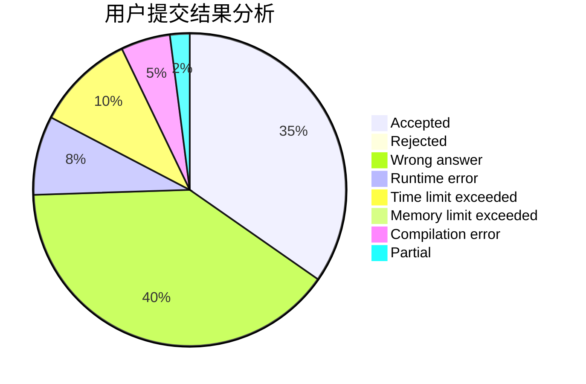
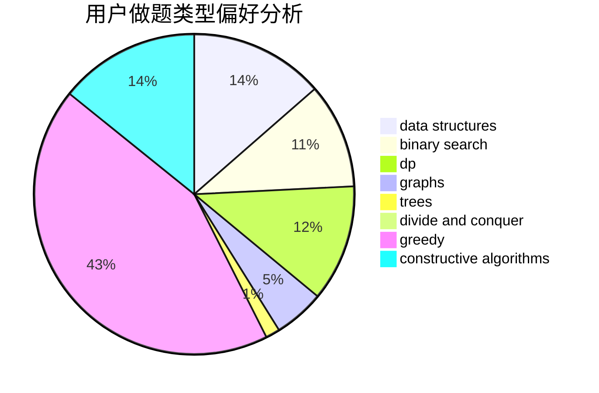
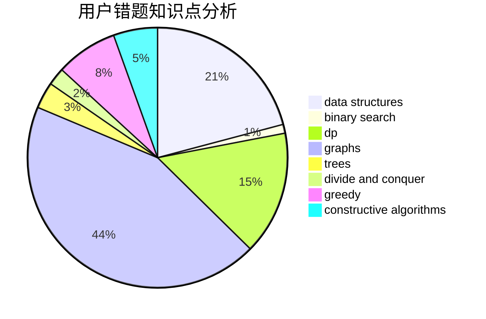

# xcxxcx

<!-- tabs:start -->

#### **用户提交结果分析**

#### **用户做题类型偏好分析**

#### **用户错题知识点分析**

<!-- tabs:end -->
# 推荐题目
[1479A](https://codeforces.com/contest/1479/problem/A)		binary search,
                        interactive,
                        ternary search		  
[940D](https://codeforces.com/contest/940/problem/D)		binary search,
                        implementation		  
[135B](https://codeforces.com/contest/135/problem/B)		brute force,
                        geometry,
                        math		  
[923B](https://codeforces.com/contest/923/problem/B)		binary search,
                        data structures		  
[1146B](https://codeforces.com/contest/1146/problem/B)		implementation,
                        strings		  
[981C](https://codeforces.com/contest/981/problem/C)		implementation,
                        trees		  
[1453C](https://codeforces.com/contest/1453/problem/C)		greedy,
                        implementation		  
[883B](https://codeforces.com/contest/883/problem/B)		constructive algorithms,
                        graphs,
                        greedy		  
[1452C](https://codeforces.com/contest/1452/problem/C)		greedy		  
[939B](https://codeforces.com/contest/939/problem/B)		implementation		  
