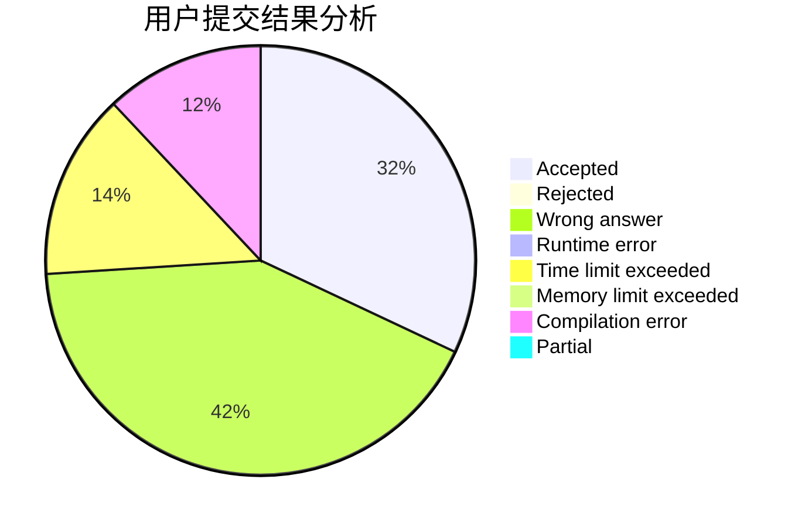
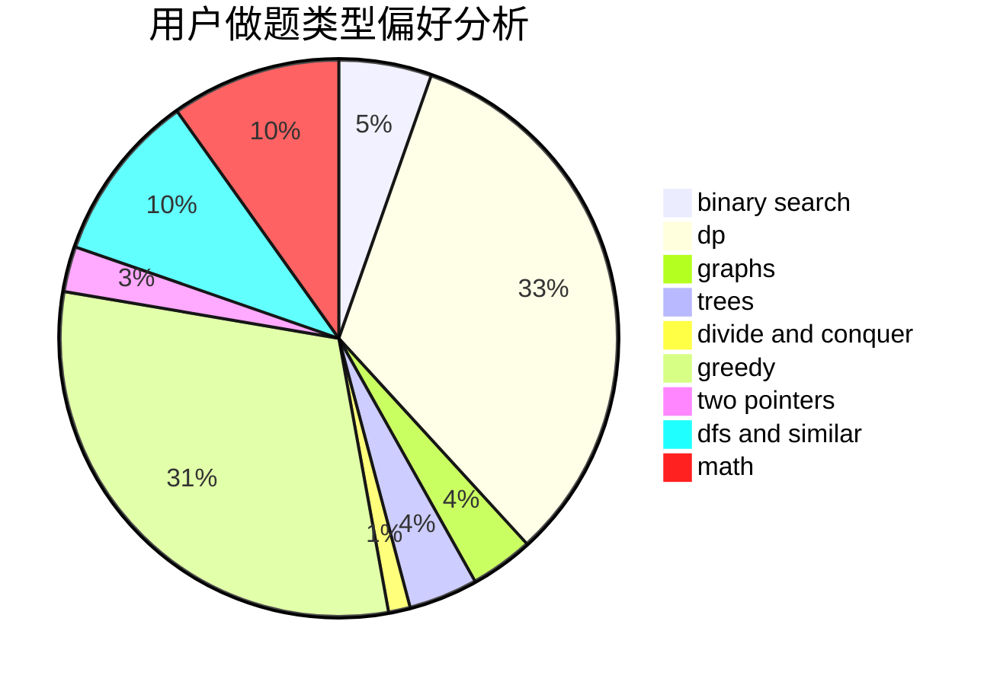

# xfhcx

<!-- tabs:start -->

#### **用户提交结果分析**

#### **用户做题类型偏好分析**

<!-- tabs:end -->
# 推荐题目
[961E](https://codeforces.com/contest/961/problem/E)
[514C](https://codeforces.com/contest/514/problem/C)
[567D](https://codeforces.com/contest/567/problem/D)
[876A](https://codeforces.com/contest/876/problem/A)
[509C](https://codeforces.com/contest/509/problem/C)
[93A](https://codeforces.com/contest/93/problem/A)
[916C](https://codeforces.com/contest/916/problem/C)
[1366E](https://codeforces.com/contest/1366/problem/E)
[774C](https://codeforces.com/contest/774/problem/C)
[463D](https://codeforces.com/contest/463/problem/D)
