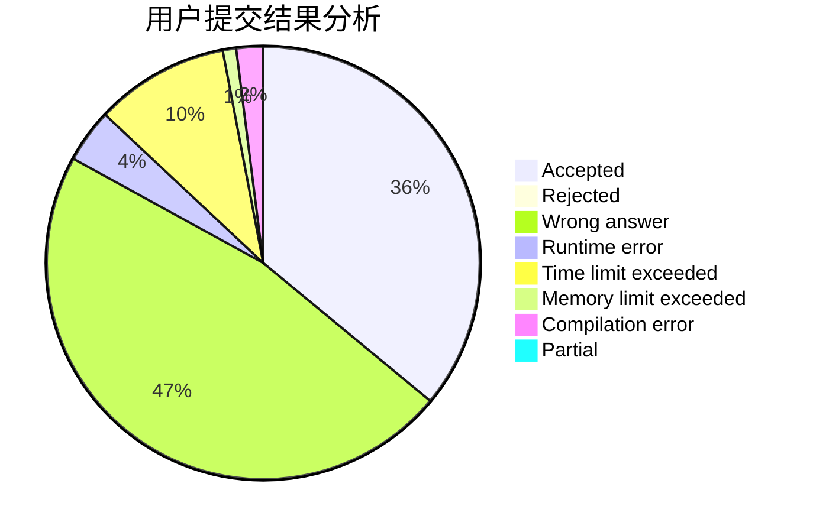
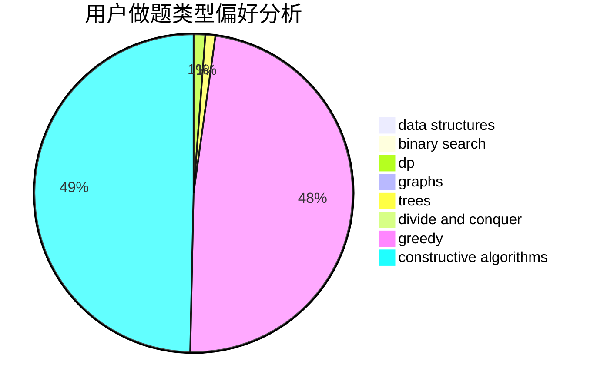
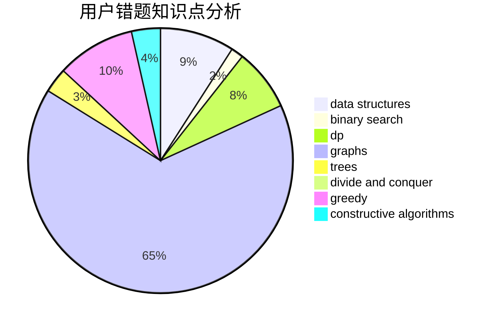

# xfzlq

<!-- tabs:start -->

#### **用户提交结果分析**

#### **用户做题类型偏好分析**

#### **用户错题知识点分析**

<!-- tabs:end -->
# 推荐题目
[831B](https://codeforces.com/contest/831/problem/B)		implementation,
                        strings		  
[903D](https://codeforces.com/contest/903/problem/D)		data structures,
                        math		  
[965A](https://codeforces.com/contest/965/problem/A)		math		  
[285A](https://codeforces.com/contest/285/problem/A)		greedy,
                        implementation		  
[472C](https://codeforces.com/contest/472/problem/C)		greedy		  
[715A](https://codeforces.com/contest/715/problem/A)		constructive algorithms,
                        math		  
[1146D](https://codeforces.com/contest/1146/problem/D)		dfs and similar,
                        math,
                        number theory		  
[954B](https://codeforces.com/contest/954/problem/B)		implementation,
                        strings		  
[922C](https://codeforces.com/contest/922/problem/C)		brute force,
                        number theory		  
[94B](https://codeforces.com/contest/94/problem/B)		graphs,
                        implementation,
                        math		  
