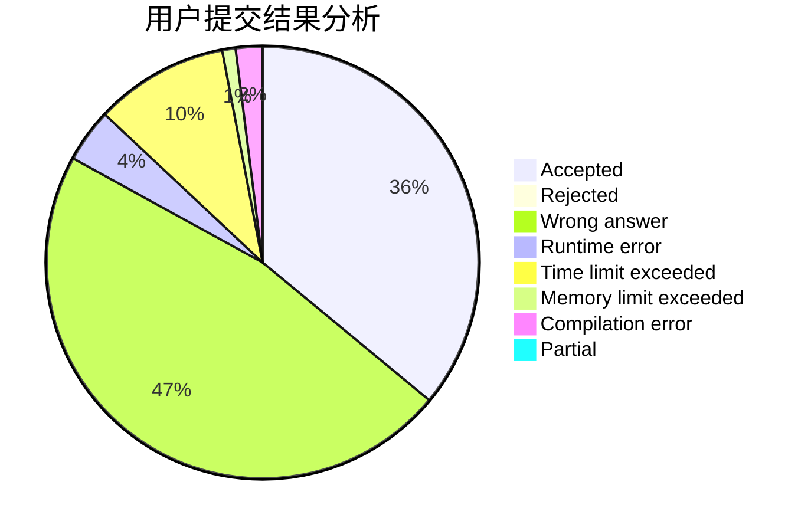
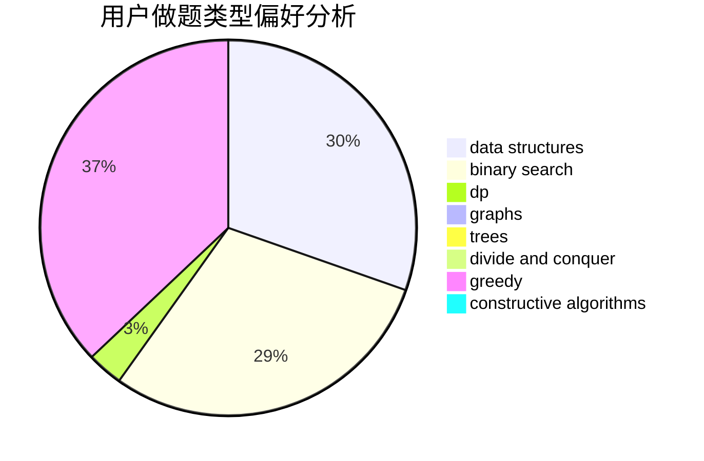
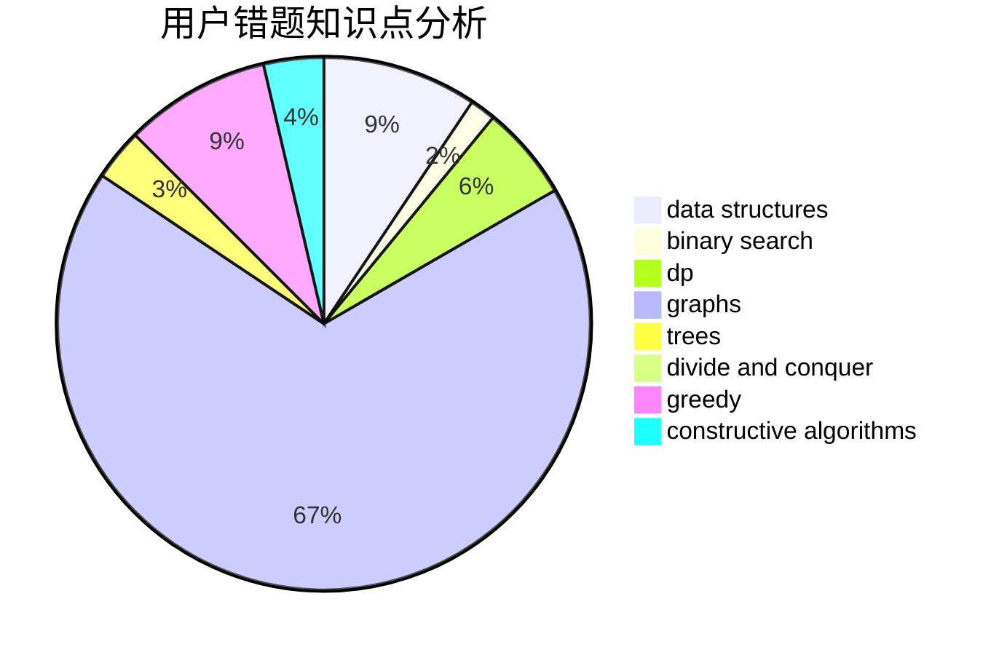

# xfzlq

<!-- tabs:start -->

#### **用户提交结果分析**

#### **用户做题类型偏好分析**

#### **用户错题知识点分析**

<!-- tabs:end -->
# 推荐题目
[849B](https://codeforces.com/contest/849/problem/B)		brute force,
                        geometry		  
[919D](https://codeforces.com/contest/919/problem/D)		dfs and similar,
                        dp,
                        graphs		  
[987A](https://codeforces.com/contest/987/problem/A)		implementation		  
[2C](https://codeforces.com/contest/2/problem/C)		geometry		  
[490F](https://codeforces.com/contest/490/problem/F)		data structures,
                        dfs and similar,
                        dp,
                        trees		  
[733C](https://codeforces.com/contest/733/problem/C)		constructive algorithms,
                        dp,
                        greedy,
                        two pointers		  
[1148D](https://codeforces.com/contest/1148/problem/D)		greedy,
                        sortings		  
[976A](https://codeforces.com/contest/976/problem/A)		implementation		  
[946C](https://codeforces.com/contest/946/problem/C)		greedy,
                        strings		  
[967A](https://codeforces.com/contest/967/problem/A)		implementation		  
