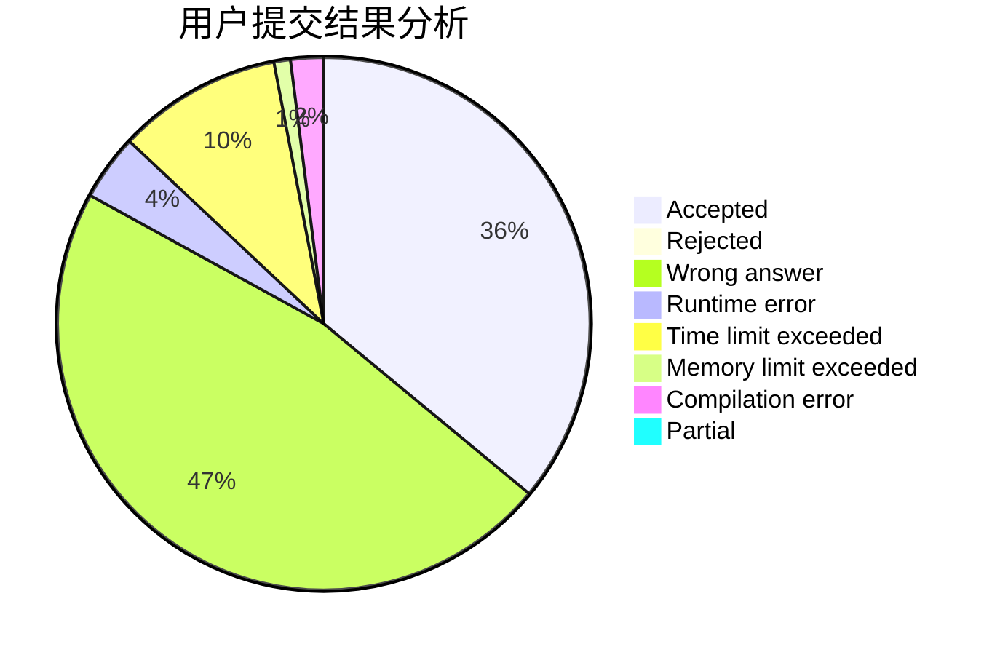
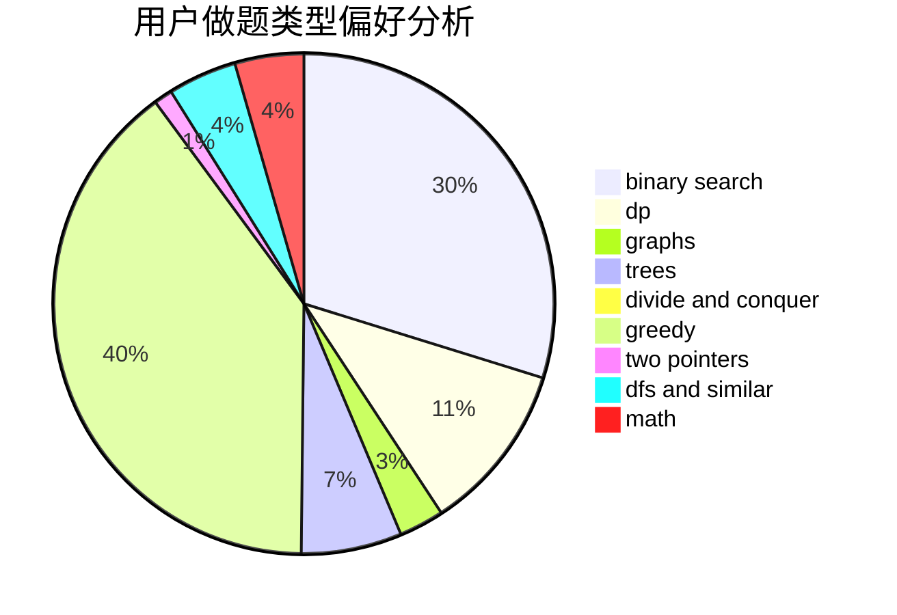

# xfzlq

<!-- tabs:start -->

#### **用户提交结果分析**

#### **用户做题类型偏好分析**

<!-- tabs:end -->
# 推荐题目
[849B](https://codeforces.com/contest/849/problem/B)
[919D](https://codeforces.com/contest/919/problem/D)
[987A](https://codeforces.com/contest/987/problem/A)
[2C](https://codeforces.com/contest/2/problem/C)
[490F](https://codeforces.com/contest/490/problem/F)
[733C](https://codeforces.com/contest/733/problem/C)
[1148D](https://codeforces.com/contest/1148/problem/D)
[976A](https://codeforces.com/contest/976/problem/A)
[946C](https://codeforces.com/contest/946/problem/C)
[967A](https://codeforces.com/contest/967/problem/A)
