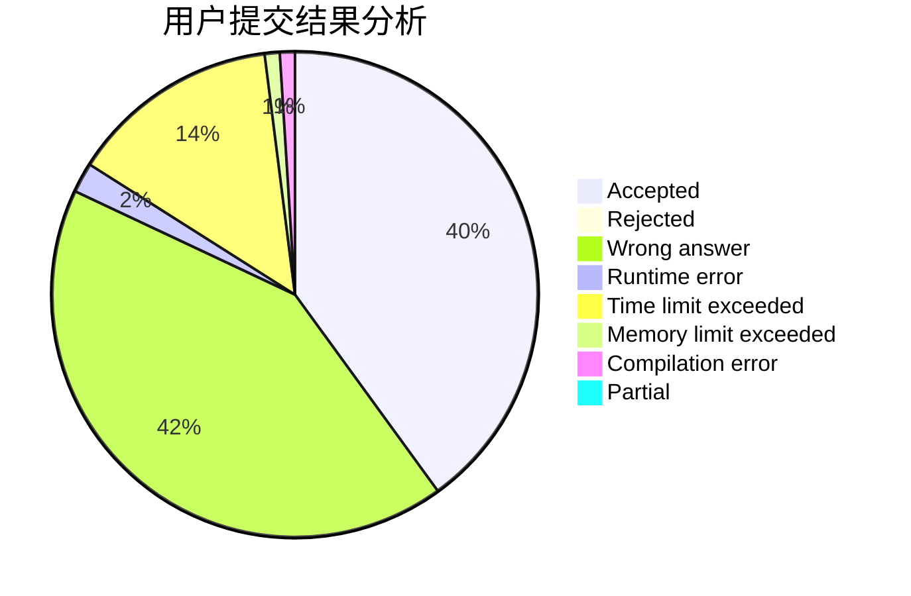
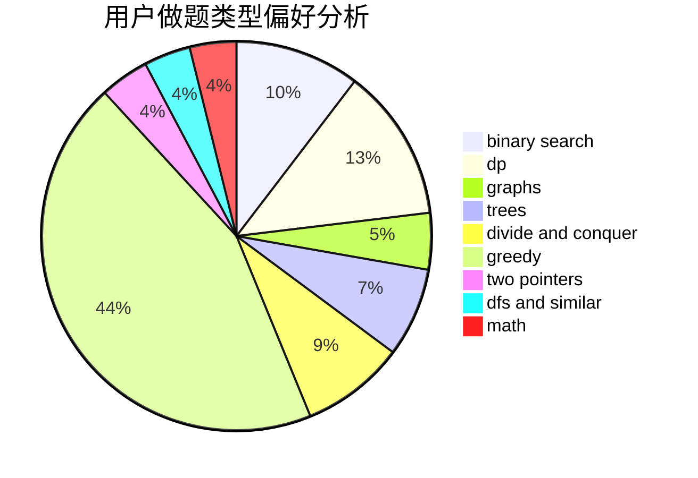

# Cantor.

<!-- tabs:start -->

#### **用户提交结果分析**

#### **用户做题类型偏好分析**

<!-- tabs:end -->
# 推荐题目
[1401B](https://codeforces.com/contest/1401/problem/B)
[1470E](https://codeforces.com/contest/1470/problem/E)
[455E](https://codeforces.com/contest/455/problem/E)
[671A](https://codeforces.com/contest/671/problem/A)
[665C](https://codeforces.com/contest/665/problem/C)
[665F](https://codeforces.com/contest/665/problem/F)
[44E](https://codeforces.com/contest/44/problem/E)
[1093B](https://codeforces.com/contest/1093/problem/B)
[607E](https://codeforces.com/contest/607/problem/E)
[1152A](https://codeforces.com/contest/1152/problem/A)
