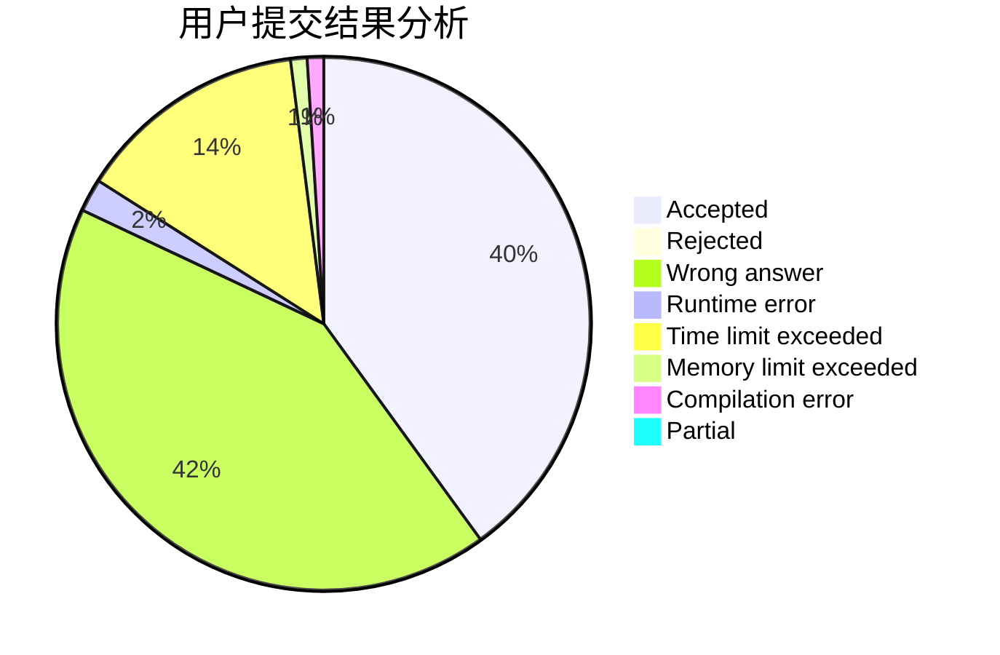
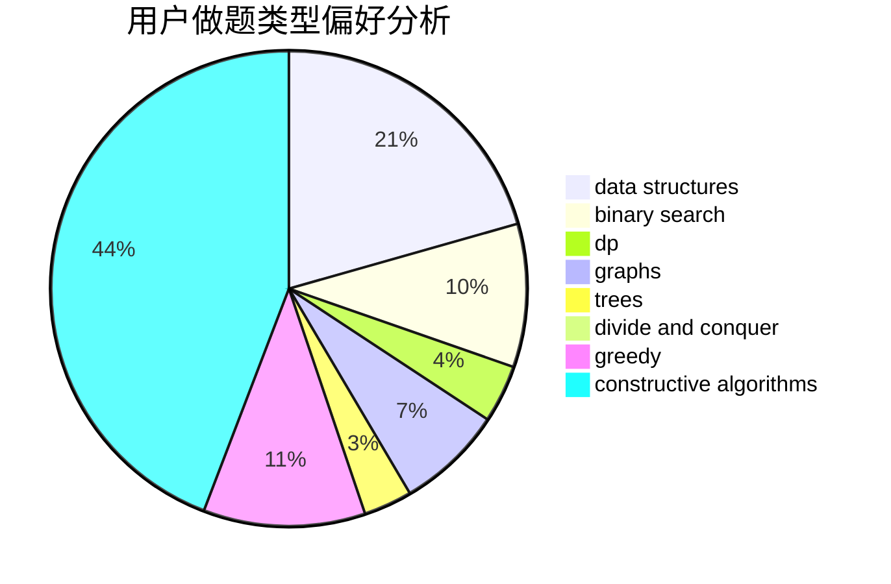
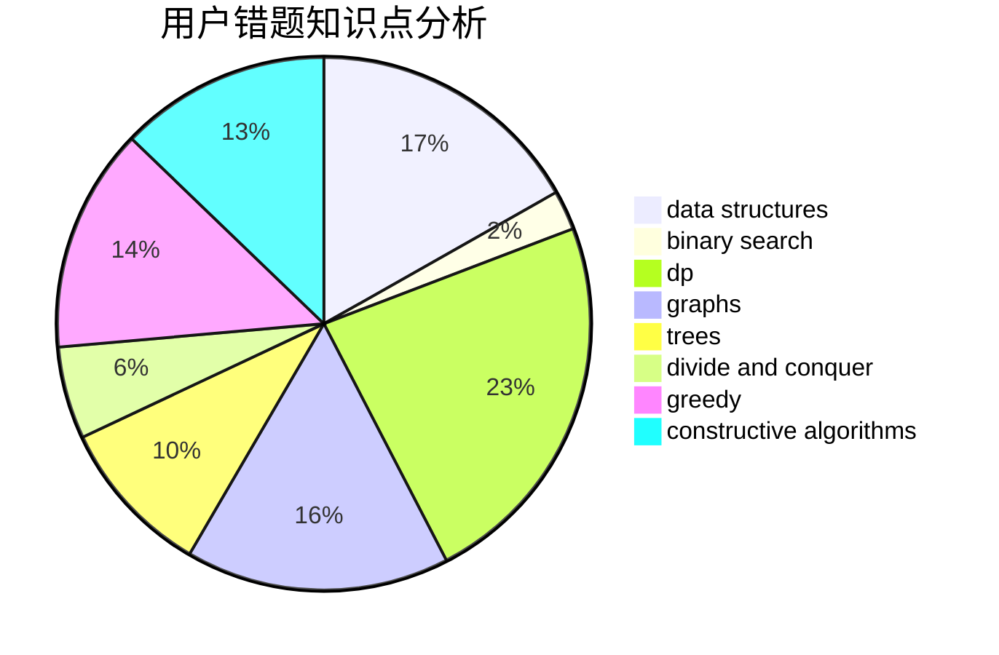

# Cantor.

<!-- tabs:start -->

#### **用户提交结果分析**

#### **用户做题类型偏好分析**

#### **用户错题知识点分析**

<!-- tabs:end -->
# 推荐题目
[1393C](https://codeforces.com/contest/1393/problem/C)		constructive algorithms,
                        greedy,
                        math,
                        sortings		  
[1463D](https://codeforces.com/contest/1463/problem/D)		binary search,
                        constructive algorithms,
                        greedy,
                        two pointers		  
[436A](https://codeforces.com/contest/436/problem/A)		greedy		  
[643G](https://codeforces.com/contest/643/problem/G)		data structures		  
[633A](https://codeforces.com/contest/633/problem/A)		brute force,
                        math,
                        number theory		  
[633D](https://codeforces.com/contest/633/problem/D)		brute force,
                        dp,
                        hashing,
                        implementation,
                        math		  
[429A](https://codeforces.com/contest/429/problem/A)		dfs and similar,
                        trees		  
[1092E](https://codeforces.com/contest/1092/problem/E)		constructive algorithms,
                        dfs and similar,
                        greedy,
                        trees		  
[587D](https://codeforces.com/contest/587/problem/D)		2-sat,
                        binary search		  
[1150A](https://codeforces.com/contest/1150/problem/A)		greedy,
                        implementation		  
