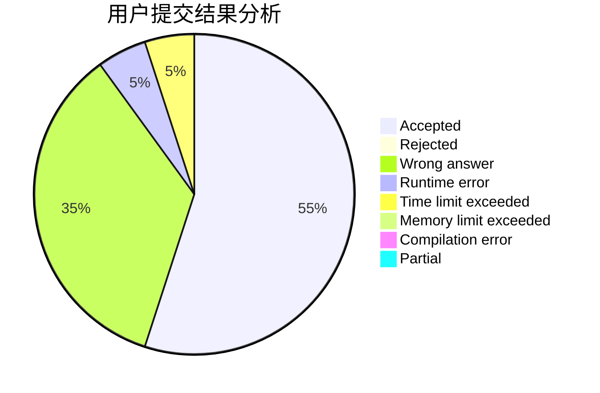
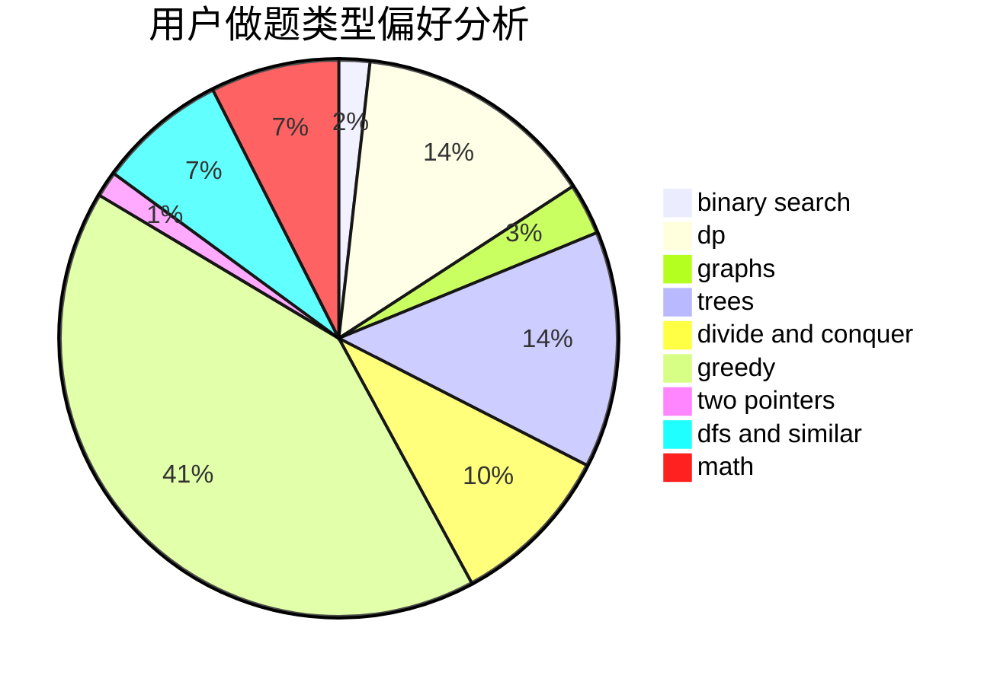

# xgzc

<!-- tabs:start -->

#### **用户提交结果分析**

#### **用户做题类型偏好分析**

<!-- tabs:end -->
# 推荐题目
[1425H](https://codeforces.com/contest/1425/problem/H)
[919C](https://codeforces.com/contest/919/problem/C)
[1325C](https://codeforces.com/contest/1325/problem/C)
[909D](https://codeforces.com/contest/909/problem/D)
[1092E](https://codeforces.com/contest/1092/problem/E)
[876A](https://codeforces.com/contest/876/problem/A)
[225D](https://codeforces.com/contest/225/problem/D)
[463A](https://codeforces.com/contest/463/problem/A)
[993D](https://codeforces.com/contest/993/problem/D)
[405D](https://codeforces.com/contest/405/problem/D)
